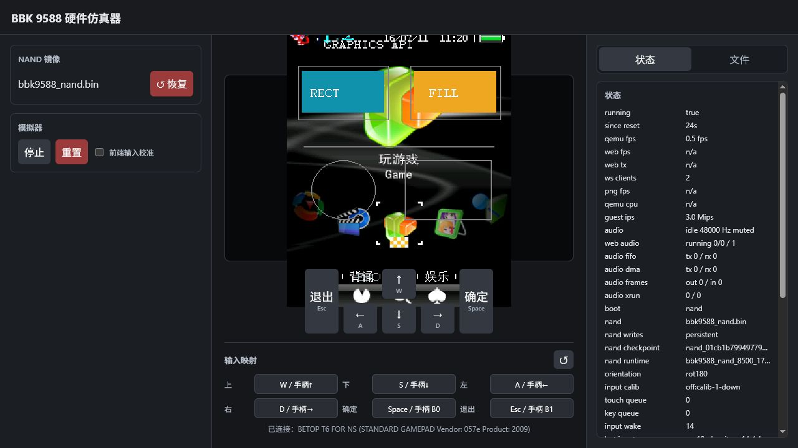
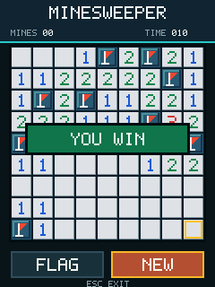

# BDA 开发文档

这里是公开 SDK 的开发者文档。只记录已经由独立 BDA 形成动态验证闭环的 API；静态
推断、候选 ABI 和失败探针保留在 [`reverse/docs/`](../reverse/docs/README.md)。

## 从这里开始

1. [安装工具链并构建第一个 BDA](getting_started.md)
2. [查看目标固件与验证环境](compatibility.md)
3. [选择一个已验证示例](../example/README.md)
4. [理解公开 API 准入规则](verified/public_api_policy.md)

## 公开头文件

| 头文件 | 用途 |
|---|---|
| [`bda_sdk.h`](../sdk/include/bda_sdk.h) | 聚合全部已验证公共模块 |
| [`bda_types.h`](../sdk/include/bda_types.h) | SDK 版本、基础类型和 handle |
| [`bda_memory.h`](../sdk/include/bda_memory.h) | freestanding 内存 helper 和 heap |
| [`bda_filesystem.h`](../sdk/include/bda_filesystem.h) | 文件、seek、目录和枚举 |
| [`bda_input.h`](../sdk/include/bda_input.h) | 按键包、原始输入事件和高速触摸坐标读取 |
| [`bda_time.h`](../sdk/include/bda_time.h) | tick、标称 1 ms counter、Frame 周期定时器和 delay |
| [`bda_window.h`](../sdk/include/bda_window.h) | Frame、消息、事件泵和生命周期 |
| [`bda_graphics.h`](../sdk/include/bda_graphics.h) | draw context、图元、文字、VX 和 picture |
| [`bda_dialogs.h`](../sdk/include/bda_dialogs.h) | 消息框、确认框、帮助页和文件选择器 |
| [`bda_controls.h`](../sdk/include/bda_controls.h) | 内建控件、GIF 与自定义控件 |
| [`bda_audio.h`](../sdk/include/bda_audio.h) | raw PCM 写入、衰减和停止 |

公开应用不要包含 `reverse/bda_research_sdk.h`。该文件中的名称、参数和生命周期仍可
变化，也可能包含真机会死锁的实验接口。

模块依赖和按需包含方法见 [SDK API 目录](sdk_api_layout.md)。

## API 指南

| 能力 | 文档 | 动态验证 |
|---|---|---|
| Message Box 与确认框 | [msgbox_api.md](verified/msgbox_api.md) | 8013 模拟器 |
| 系统帮助页 | [help_page_api.md](verified/help_page_api.md) | 8013 模拟器 |
| 系统文件选择器 | [file_selector_api.md](verified/file_selector_api.md) | 8013 模拟器 |
| 文件写入与读回 | [fs_write_api.md](verified/fs_write_api.md) | 8013 模拟器 |
| 六键轮询 | [input_polling_api.md](verified/input_polling_api.md) | 8013 模拟器 |
| 高速触摸坐标读取 | [touch_position_api.md](verified/touch_position_api.md) | 真机 |
| GAMEBOY 式原始输入事件 | [raw_input_event_api.md](verified/raw_input_event_api.md) | 真机 |
| 触摸坐标与窗口生命周期 | [touch_window_lifecycle_api.md](verified/touch_window_lifecycle_api.md) | 真机 |
| 图形图元 | [graphics_primitives_api.md](verified/graphics_primitives_api.md) | 8013 模拟器 |
| 双缓冲、VX、dirty rect、tick | [game_rendering_api.md](verified/game_rendering_api.md) | 8013 模拟器 |
| 高分辨率计时 | [high_resolution_timer_api.md](verified/high_resolution_timer_api.md) | 模拟器 + 真机 |
| 窗口消息定时器 | [window_timer_api.md](verified/window_timer_api.md) | 模拟器 + 真机 |
| Raw RGB565 picture | [picture_rendering_api.md](verified/picture_rendering_api.md) | 8013 模拟器 |
| 堆、seek、目录与枚举 | [runtime_services_api.md](verified/runtime_services_api.md) | 8013 模拟器 |
| 内建控件、GIF 与自定义类 | [controls_api.md](verified/controls_api.md) | 8013 模拟器 |
| Raw PCM 音频生命周期 | [audio_pcm_api.md](verified/audio_pcm_api.md) | 模拟器 + 真机 |

## 教程

- [窗口生命周期与触摸重绘](verified/touch_window_lifecycle_api.md)
- [游戏离屏绘制、精灵和计时](verified/game_rendering_api.md)
- [标称 1 ms timer 生命周期](verified/high_resolution_timer_api.md)
- [用窗口定时消息驱动周期任务](verified/window_timer_api.md)
- [自定义控件](tutorials/custom_controls.md)
- [完整扫雷示例](minesweeper_v1.md)
- [SDK API 目录与公开/研究边界](sdk_api_layout.md)

每篇 API 文档都会标出验证环境和已知边界。没有动态证据的接口不得加入公开 SDK。
