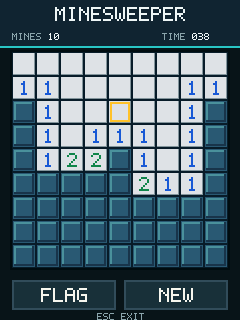
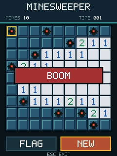

# Minesweeper V1

源码：`example/games/minesweeper/minesweeper_bda.c`

预编译产物：`example/games/minesweeper/MinesweeperV1.bda`

动态验证等级：8013 完整 NAND 固件路径通过；BBK 9588 真机待复测。

## 构建

```powershell
python -m bda_packer example\games\minesweeper\minesweeper_bda.c `
  --title MinesV1 --category 4 `
  --icon-png example\games\minesweeper\minesweeper_icon.png `
  -o example\games\minesweeper\MinesweeperV1.bda
```

`category=4` 对应固件的“娱乐天地”分类。图标源文件为
`example/games/minesweeper/minesweeper_icon.png`，打包器会生成固件需要的两个 `80x80` 图标，以及
`54x54` 和 `58x58` RGB565 VX 图标。

原版固件的分类 4 已占满 10 个菜单项；直接追加第 11 个 BDA 不会显示。8013 验证时
只在专用测试 NAND 中替换已有的 `雷霆战机.bda` 路径，菜单第二页成功显示新标题和
图标，并可启动后通过 ESC 正常返回。`C200.bin` 校验哈希保持不变。

最终测试包 SHA-256：

```text
ea450c6cb3c622eb4da274e41901c935fc1adfa85990a50803c0879fa0705298
```


## 操作

- 触摸格子：在 OPEN 模式开格；已打开数字在周围旗数相等时执行快速展开。
- `FLAG`：切换插旗模式，再触摸格子插旗或取消。
- `NEW`：立即生成新局；雷区延迟到第一次开格时生成。
- 方向键：移动黄色光标。
- 确认键：打开光标格；胜负结束后开始新局。
- ESC：退出并返回主菜单。

棋盘为 9x9、10 雷。首击格及周围 3x3 区域不会放雷；计时使用
`GUI+0x6d8` 的 25 ms tick，最高显示 999 秒。

## 绘图与生命周期

程序在内存中生成完整 `240x320` RGB565 VX 画面，先通过 `GUI+0x540` 写到
compatible back context，再在一次 `GUI+0x074(1/0)` guard 中使用 `GUI+0x418`
提交到 visible context。所有文字均为内置 5x7 bitmap font，不调用逐字系统文本绘制。
这些能力已经以稳定名称进入 `sdk/include/bda_sdk.h`，开发用法和图解见
[`verified/game_rendering_api.md`](verified/game_rendering_api.md)。

顶层 frame 使用 `style=0`、`surface=0`。退出顺序为：

```text
frame stop -> frame release -> event poll 结束 -> frame close
-> compatible context free -> bda_main return
```

## 8013 结果

验证内容：首击安全、零区域洪泛、数字、插旗/取消、重开、踩雷揭示、自动解盘获胜、
触摸后实体 ESC 退出。实时日志位于 `A:\应用\数据\游戏\MINESV1.TXT`。

关键日志：

```text
FIRST VX DRAW=0x00000000
FIRST PRESENT=0x00000000
LOST CELL=0x00000000
WON TICKS=0x000001A5
ESC DOWN
ESC UP
STOP=0x00000001
RELEASE=0x00000000
BACK FREED
FAILURES=0x00000000
RESULT=PASS
```






该结果证明模拟器完整固件路径可运行，并支持本文绘制链以“模拟器稳定”等级进入公开
SDK；它不自动升级为真机通过。真机测试重点是 compatible surface 长时间稳定性、
六键状态和触摸/按键切换后的输入抑制。
