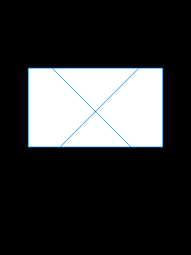
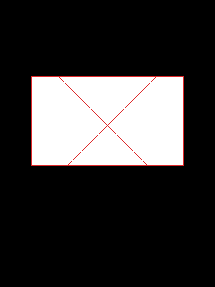

# 自定义控件教程

自定义控件适合游戏 HUD、特殊按钮、画板或固件没有提供的交互部件。已验证示例位于
`example/gui/custom_control/custom_control_demo.c`，只依赖 `bda_controls.h`。

## 1. 注册类

类名、window procedure 和注册期间使用的数据必须在类注销前保持有效：

```c
static const char class_name[] = "SDK_CUSTOM";

static int custom_proc(
    bda_handle_t handle, u32 message, u32 wparam, u32 lparam
) {
    if (message == BDA_MSG_TOUCH_COORDINATE) {
        pressed = !pressed;
        dirty = 1;
    }
    return bda_gui_default_proc(handle, message, wparam, lparam);
}

bda_control_class_desc_t class_descriptor;
bda_memset(&class_descriptor, 0, sizeof(class_descriptor));
class_descriptor.class_name = class_name;
class_descriptor.draw_object = bda_gui_draw_object_create(15);
class_descriptor.wndproc = custom_proc;

if (!bda_control_class_register(&class_descriptor)) {
    return 1;
}
```

`reserved04` 和 `reserved08` 保持 0。验证机上 `bda_gui_draw_object_create(15)` 返回
`0x0000ffff`，但注册和绘制正常；它是固件对象表的值，不能按普通 control handle 的
规则判断失败。

未知消息必须交给 `bda_gui_default_proc()`。不要默认返回 0，否则控件的创建、焦点、
绘制上下文绑定或销毁消息可能被截断。

## 2. 创建子控件

先创建并激活 frame，再把 frame 作为 `parent`：

```c
bda_control_desc_t control_descriptor;
bda_memset(&control_descriptor, 0, sizeof(control_descriptor));
control_descriptor.class_name = class_name;
control_descriptor.caption = "TOUCH ME";
control_descriptor.style = BDA_BUTTON_STYLE_DEFAULT;
control_descriptor.id = 0x301;
control_descriptor.x = 35;
control_descriptor.y = 85;
control_descriptor.width = 170;
control_descriptor.height = 100;
control_descriptor.parent = frame;

control = bda_control_create(&control_descriptor);
```

自定义 procedure 收到的 `BDA_MSG_TOUCH_COORDINATE` 坐标是 control-local 坐标，而
不是屏幕坐标。`caption`、`flags`、`extra` 是否有特殊含义取决于自己的 procedure；
不使用时保持 0 或只作为稳定存储指针使用。

## 3. 在控件局部区域绘制

绘制必须成对使用 object paint scope 和 draw guard：

```c
static void paint(void) {
    bda_handle_t draw = bda_gui_object_draw_begin(control);
    if (!bda_control_is_valid(draw)) {
        return;
    }

    bda_gui_draw_guard_begin();
    bda_gui_put_pixel_rgb(draw, 0, 0, 24, 132, 220);
    /* 坐标范围是 0..width-1、0..height-1。 */
    bda_gui_draw_guard_end();
    bda_gui_object_draw_end(control, draw);
}
```

不要在触摸 callback 内执行大面积逐像素绘制。callback 只更新状态并置 `dirty = 1`，
主 event loop 在 dispatch 返回后再调用 `paint()`；这样可避免重入固件绘制过程。





## 4. 消息循环和退出

frame procedure 负责识别 frame 的 Escape 消息和 detach；custom procedure 只负责自身
交互。主循环持续调用 `bda_gui_event_pump_frame_once()`，处理 dirty 后短暂
`bda_sys_delay(1)`。

退出顺序不能交换：

1. 等待 Escape 释放。
2. `bda_control_destroy(control)`。
3. `bda_gui_frame_stop(frame)` 和 `bda_gui_frame_release(frame)`。
4. 继续 pump 到无消息、detach 或有限超时。
5. `bda_gui_close_frame(frame)`。
6. `bda_control_class_unregister(class_name)`。

先注销类再销毁实例会让 control 的后续 destroy 消息找不到 procedure。先关闭 frame 再
销毁 child 则会留下 parent 链和固件资源。完整探针日志：
[custom_control_probe_log.txt](../verified/assets/custom_control_probe_log.txt)。

## 验证边界

8013 验证覆盖类注册、实例创建、局部绘制、触摸切换、第二次重绘、实例销毁、frame
关闭和类注销。没有验证 timer、键盘焦点遍历、多个同类实例共享状态或真机行为；这些
能力需要新的独立测试，不能从本教程自动推导。

公开 `CustomControl.bda` 的 SHA-256：

```text
ac7d0918b0f456f6b58d2a90bd571dc25121d54be21ffff83342b0334455df64
```
