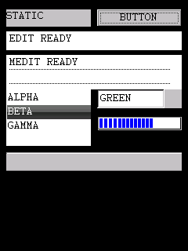
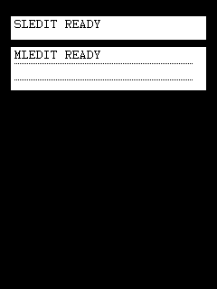
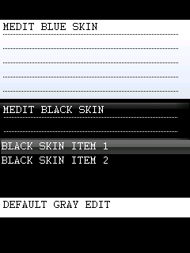
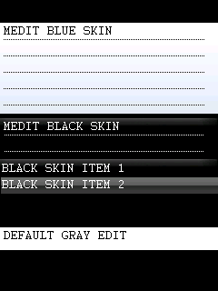
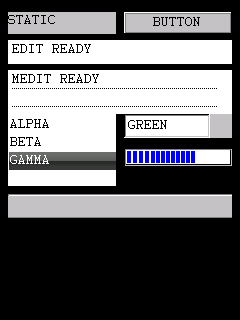
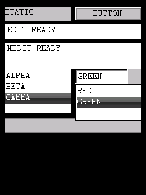
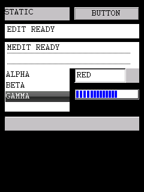

# 控件 API

`sdk/include/bda_controls.h` 收录 kj409588/C200 固件上已由独立 BDA 在 8013 模拟器
动态验证的控件接口。它会自动包含 `bda_sdk.h`：

```c
#include "bda_controls.h"
```

验证使用 `E:\bbk9588-emulator-v0.1.5` 的专用 `runtime\bda_test` NAND。测试时
`C200.bin` SHA-256 始终为
`02a16107b11a3281067871c6fe3d4c289c910d8dfa9924573dd87f00351d6525`。
模拟器结果不自动等于真机结果。

## 已公开控件

| 类宏 | 真实类名 | 已验证范围 |
|---|---|---|
| `BDA_CONTROL_CLASS_STATIC` | `static` | 创建、标题可见、销毁 |
| `BDA_CONTROL_CLASS_BUTTON` | `button` | 创建、激活、Enter 命令通知、销毁 |
| `BDA_CONTROL_CLASS_EDIT` | `edit` | 文本长度、设置、读回、触摸焦点、销毁 |
| `BDA_CONTROL_CLASS_SLEDIT` | `sledit` | 文本长度、设置、读回、触摸焦点、销毁 |
| `BDA_CONTROL_CLASS_MEDIT` | `medit` | 文本长度、设置、读回、触摸焦点、销毁 |
| `BDA_CONTROL_CLASS_MLEDIT` | `mledit` | 文本长度、设置、读回、触摸焦点、销毁 |
| `BDA_CONTROL_CLASS_LISTBOX` | `listbox` | 添加、数量、选择、文本读回、触摸选择、销毁 |
| `BDA_CONTROL_CLASS_COMBOBOX` | `combobox` | 添加、数量、选择、展开和触摸选择、销毁 |
| `BDA_CONTROL_CLASS_PROGRESSBAR` | `progressbar` | 范围、步长、位置、步进、可见进度、销毁 |
| `BDA_CONTROL_CLASS_TOOLBAR` | `toolbar` | 创建、区域可见、销毁；item ABI 未验证 |
| `BDA_CONTROL_CLASS_GIFCTRL` | `gifctrl` | 内存 GIF89a 加载、解码、自动换帧、循环、销毁 |

`sledit` 和 `mledit` 是固件实际注册的类名，不是 SDK 兼容别名。每个类对应的默认
样式常量为 `BDA_STATIC_STYLE_DEFAULT`、`BDA_BUTTON_STYLE_DEFAULT`、
`BDA_EDIT_STYLE_DEFAULT`、`BDA_SLEDIT_STYLE_DEFAULT`、
`BDA_MEDIT_STYLE_DEFAULT`、`BDA_MLEDIT_STYLE_DEFAULT`、
`BDA_LISTBOX_STYLE_DEFAULT`、`BDA_COMBOBOX_STYLE_DEFAULT`、
`BDA_PROGRESSBAR_STYLE_DEFAULT`、`BDA_TOOLBAR_STYLE_DEFAULT`、
`BDA_GIFCTRL_STYLE_EMPTY` 和 `BDA_GIFCTRL_STYLE_ANIMATED`。这些名称只表示验证探针
所用值，不推断各 bit 的通用含义。





## 外观与皮肤

画廊中的灰色控件是固件 fallback 外观，不是截图或颜色转换错误。
`BDA_*_STYLE_DEFAULT` 只表示探针使用的 style 值，不会自动加载 shell 皮肤。

原版记事本会自行加载 `text_A.dlx` / `text_B.dlx`，再给 `medit` 绑定 240x265 VX
页面背景；黑色主题还会替换绘制对象。`listbox` 使用另一组 class-specific 消息，
标题栏和工具栏等区域则由父窗口直接绘制 DLX 资源。它不是所有控件共享的 theme API。

8013 的独立 `ControlSkinBindingV2.bda` 已动态验证以下公开 helper：

- `bda_medit_set_background_vx()`：`BDA_MEDIT_MSG_SET_BACKGROUND_VX`，绑定完整 VX。
- `bda_medit_set_draw_object()`：`BDA_MEDIT_MSG_SET_DRAW_OBJECT`，设置分槽绘制对象。
- `bda_listbox_set_background_vx()`：`BDA_LISTBOX_MSG_SET_BACKGROUND_VX`，绑定完整 VX。
- `bda_listbox_set_draw_object()`：`BDA_LISTBOX_MSG_SET_DRAW_OBJECT`，设置分槽绘制对象。

探针加载 `text_A.dlx` 的 0 基资源 `#11` 作为浅蓝背景，并加载
`enote_black_add.dlx` 的 `#01` 作为黑色背景。四个消息都返回 `0`，但控件实际完成
重绘，因此这些返回值不能按 Boolean success 判断。黑色主题所用绘制对象来自
`bda_gui_draw_object_create(15)`；当前固件观察值是 `0x0000ffff`。

```c
void *dark_draw_object = bda_gui_draw_object_create(15);

bda_medit_set_background_vx(medit, blue_vx);

bda_medit_set_background_vx(dark_medit, black_vx);
bda_medit_set_draw_object(dark_medit, 1, dark_draw_object);

bda_listbox_set_background_vx(listbox, black_vx);
bda_listbox_set_draw_object(listbox, 1, dark_draw_object);
```

VX 参数必须指向包含 24-byte `VX` header 的完整资源，不是裸 RGB565 pixels。控件只
保存该指针，不复制资源：先销毁所有引用它的控件，完成 frame 关闭，再调用
`bda_free()` 释放 VX。探针正是按这个顺序退出并返回系统菜单。





完整退出日志：[controls_skin_binding_v2_log.txt](assets/controls_skin_binding_v2_log.txt)。
探针源码为 `reverse/examples/control_skin_binding_probe.c`；原应用与 C200 的地址链见
`reverse/reports/notepad_bda_report.md`。当前只验证 240x265 页面背景、slot 1 和
draw object 15；其他 VX 尺寸、slot、绘制对象以及对 `edit` 使用 `0xf0dd` 尚未公开。

## 创建与生命周期

`bda_control_desc_t` 的字段为 `class_name`、`caption`、`style`、`flags`、`id`、`x`、
`y`、`width`、`height`、`parent` 和 `extra`。普通子控件的 `parent` 必须是已经注册并
激活的 frame；坐标相对 parent。未验证的 `flags` 和 `extra` 应保持 0；`gifctrl` 是
已验证的例外，其 `extra` 指向下文的资源描述。

```c
bda_control_desc_t descriptor;
bda_handle_t button;

bda_memset(&descriptor, 0, sizeof(descriptor));
descriptor.class_name = BDA_CONTROL_CLASS_BUTTON;
descriptor.caption = "OK";
descriptor.style = BDA_BUTTON_STYLE_DEFAULT;
descriptor.id = 0x201;
descriptor.x = 20;
descriptor.y = 40;
descriptor.width = 100;
descriptor.height = 24;
descriptor.parent = frame;

button = bda_control_create(&descriptor);
if (!bda_control_is_valid(button)) {
    /* 0 和 0xffffffff 都是失败。 */
}
```

通用函数为 `bda_control_create()`、`bda_control_send()`、
`bda_control_set_active()`、`bda_control_destroy()` 和 `bda_control_is_valid()`。
`bda_control_set_active()` 在按钮验证中返回 0 但确实改变了 active child，因此不能把其
返回值当 Boolean success。`bda_control_destroy()` 的成功返回值为 1，只用于子控件；
顶层 frame 仍使用 frame 生命周期函数。

退出顺序必须是：先逆序 `bda_control_destroy()` 所有子控件，再
`bda_gui_frame_stop()`、`bda_gui_frame_release()`，排空消息后
`bda_gui_close_frame()`。不要在 frame 已关闭后销毁 child。

## 文本控件

`edit`、`sledit`、`medit` 和 `mledit` 已验证以下 helper：

```c
bda_text_control_set_max_length(edit, 31);
bda_text_control_set_text(edit, "EDIT READY");
bda_text_control_get_text(edit, buffer, sizeof(buffer));
```

对应消息为 `BDA_TEXT_CONTROL_MSG_SET_MAX_LENGTH`、
`BDA_TEXT_CONTROL_MSG_SET_TEXT` 和 `BDA_TEXT_CONTROL_MSG_GET_TEXT`。单行控件读回时
观察到返回字符数，多行控件可能返回 0 但仍正确写入 buffer，调用者必须以 buffer 内容
为准并预先清零。

## 列表和组合框

列表 helper 为 `bda_listbox_append_item()`、`bda_listbox_get_count()`、
`bda_listbox_set_selection()`、`bda_listbox_get_selection()` 和
`bda_listbox_get_item_text()`，对应
`BDA_LISTBOX_MSG_APPEND_ITEM`、`BDA_LISTBOX_MSG_GET_COUNT`、
`BDA_LISTBOX_MSG_SET_SELECTION`、`BDA_LISTBOX_MSG_GET_SELECTION`、
`BDA_LISTBOX_MSG_GET_ITEM_TEXT`。item text 消息不接收容量，调用者必须提供足以容纳
原字符串的 buffer。

组合框 helper 为 `bda_combobox_append_item()`、`bda_combobox_get_count()`、
`bda_combobox_set_selection()` 和 `bda_combobox_get_selection()`，对应
`BDA_COMBOBOX_MSG_APPEND_ITEM`、`BDA_COMBOBOX_MSG_GET_COUNT`、
`BDA_COMBOBOX_MSG_SET_SELECTION`、`BDA_COMBOBOX_MSG_GET_SELECTION`。







## 进度条和命令通知

进度条使用 `bda_progressbar_set_range()`、`bda_progressbar_set_step()`、
`bda_progressbar_set_position()` 和 `bda_progressbar_step()`。对应消息为
`BDA_PROGRESSBAR_MSG_SET_RANGE`、`BDA_PROGRESSBAR_MSG_SET_STEP`、
`BDA_PROGRESSBAR_MSG_SET_POSITION`、`BDA_PROGRESSBAR_MSG_STEP`。

子控件向 parent 发送 `BDA_CONTROL_MSG_COMMAND`。`wparam` 低 16 bit 是 control id，
高 16 bit 是通知 code，可用 `bda_control_command_id()` 和
`bda_control_command_code()` 解码。按钮 Enter 测试观察到 code `2,0,3`，列表和
组合框也会发多种 code；这些 code 的完整语义尚未命名，应用应只处理自己实测需要的
组合，不要猜测 Windows 控件常量。

## GIF 加载与播放

`BDA_GIFCTRL_STYLE_ANIMATED` 会启用固件内置 GIF 解码器和控件定时器；当前动态验证
样本为 GIF89a。
资源不是文件路径，而是常驻内存中的 `bda_gifctrl_resource_t`：

```c
static const u8 gif_bytes[] = { /* 完整 GIF 文件字节 */ };
static const bda_gifctrl_resource_t gif_resource = {
    gif_bytes,
    0,       /* reserved04 必须为 0 */
    0x241u,  /* timer_id；本例与 control id 相同 */
};

bda_memset(&descriptor, 0, sizeof(descriptor));
descriptor.class_name = BDA_CONTROL_CLASS_GIFCTRL;
descriptor.style = BDA_GIFCTRL_STYLE_ANIMATED;
descriptor.id = 0x241u;
descriptor.x = 104;
descriptor.y = 88;
descriptor.width = 32;
descriptor.height = 32;
descriptor.parent = frame;
descriptor.extra = (u32)&gif_resource;
gif_control = bda_control_create(&descriptor);
```

`data` 和资源描述本身必须保持有效，直到 `bda_control_destroy(gif_control)` 返回；不能把
局部数组或已经释放的文件 buffer 传给控件。`reserved04` 在已恢复的控件过程里没有被
读取，公开 ABI 要求写 0。`timer_id` 用于注册、重设和删除控件定时器，建议使用该控件
唯一的 `id`。固件解析器不接收 buffer 长度，应用只能加载可信且完整的 GIF 数据。

8013 探针使用两帧 GIF，每帧延时 1 秒。连续截图稳定地在红、绿两帧间切换：


退出日志依次出现 `DESTROY=0x00000001`、frame stop/release、`RESULT=PASS`，随后返回
系统菜单，证明 timer 和 draw context 随控件销毁完成回收。完整日志：
[controls_gifctrl_probe_log.txt](assets/controls_gifctrl_probe_log.txt)。

## 自定义类接口

`bda_control_class_desc_t` 包含 `class_name`、`reserved04`、`reserved08`、
`draw_object` 和 `wndproc`。`reserved04`、`reserved08` 必须为 0。注册和注销函数为
`bda_control_class_register()` 与 `bda_control_class_unregister()`；完整用法见
[自定义控件教程](../tutorials/custom_controls.md)。

## 未公开项

- `treeview`：当前启动环境创建结果始终为 `0xffffffff`，没有进入公开头。
- `SLIDERCTRL`：这是 C200 启动期注册的私有 custom class。通用创建虽返回句柄，但
  首次重绘后任务不再响应；固件原调用点会另外分配私有状态并通过 `extra` 传入。
- `gifctrl`：内存 GIF 的加载、自动播放和释放已经公开；文件路径直接加载、暂停、跳帧、
  播放次数控制和损坏数据容错尚未验证。
- `toolbar`：只验证空 toolbar 生命周期，按钮/item 数据结构与通知尚未公开。


完整运行日志：[controls_gallery_probe_log.txt](assets/controls_gallery_probe_log.txt)。
公开示例：`example/gui/control_gallery/control_gallery_demo.c`、
`example/gui/gif_player/gif_player_demo.c` 和各自同目录 BDA。研究探针保留在
`reverse/examples/control_gallery_probe.c`、
`control_extended_probe.c`、`control_gifctrl_probe.c` 和
`control_special_probe.c`。公开 BDA SHA-256：

```text
ControlGallery.bda  479ae7b3684d61afd63ee2c794e5fd4c512d21a4be5eb8583e81c3888fb3275e
CustomControl.bda   ac7d0918b0f456f6b58d2a90bd571dc25121d54be21ffff83342b0334455df64
GifPlayer.bda       719ceb603480287774984f7e5224a65af85fe99c0fe23fe1620af53b45a5c6b4
```
