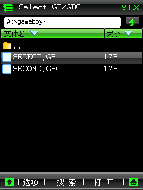
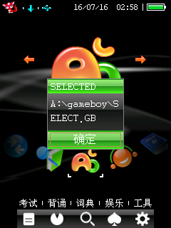

# 系统文件选择器 API

`bda_gui_select_file()` 封装了原版 `GAMEBOY.BDA` 使用的系统模态文件选择器。应用只需
提供默认目录、后缀过滤和标题；SDK 负责描述符初始化、结果路径拼接以及固件链表释放。



## 接口

```c
#include "bda_dialogs.h"

#define BDA_FILE_SELECTOR_ERROR     (-1)
#define BDA_FILE_SELECTOR_CANCELLED  0
#define BDA_FILE_SELECTOR_SELECTED   1

typedef struct bda_file_selector {
    char path[BDA_FILE_SELECTOR_PATH_SIZE];
    u8 directory_state[BDA_FILE_SELECTOR_DIRECTORY_STATE_SIZE];
} bda_file_selector_t;

int bda_gui_select_file(
    bda_file_selector_t *selector,
    const char *default_path,
    const char *extensions,
    const char *title
);
```

`default_path` 应传绝对目录，通常以反斜杠结尾，例如 `"A:\\gameboy\\"`。
`extensions` 不写点号，多个后缀用分号分隔，例如 `"gb;gbc"`。匹配不区分大小写。

选择成功时函数返回 `BDA_FILE_SELECTOR_SELECTED`，并把可直接交给文件 API 的完整路径
写入 `selector.path`。用户关闭窗口时返回 `BDA_FILE_SELECTOR_CANCELLED`，路径清空。
参数无效、路径过长或固件返回了不完整结果时返回 `BDA_FILE_SELECTOR_ERROR`。



## 用法

```c
#include "bda_dialogs.h"

static bda_file_selector_t selector;

int result = bda_gui_select_file(
    &selector,
    "A:\\gameboy\\",
    "gb;gbc",
    "Select GB/GBC"
);
if (result == BDA_FILE_SELECTOR_SELECTED) {
    int file = bda_fs_fopen_raw(selector.path, "rb");
    /* use file */
}
```

`bda_gui_select_file()` 是同步模态调用；文件选择窗口关闭前不会返回。不要在窗口回调或
持有 draw context 时调用它。`bda_file_selector_t` 必须在调用期间保持有效，返回后可以
复用或丢弃。

## 生命周期与内部所有权

公开 wrapper 复刻以下已确认链路：

```text
GUI+0x6a8(1)
GUI+0x6c8(&descriptor)
GUI+0x6b8(list_head, selected_index)
copy current_directory + selected_name
GUI+0x6bc(list_head)
```

`GUI+0x6c8` 的结果节点只保存文件名，当前目录保留在描述符的路径缓冲区中。SDK 在
`GUI+0x6bc` 释放节点之前拼接并复制完整路径，因此开发者不能也不需要接触固件链表。

## 验证记录

验证环境为 `E:\bbk9588-emulator-v0.1.5` 的 8013 完整 NAND 模式，C200 SHA-256：

```text
02a16107b11a3281067871c6fe3d4c289c910d8dfa9924573dd87f00351d6525
```

测试 BDA：`reverse/examples/file_selector_admission_probe.c`。它在 `A:\gameboy\` 创建
`SELECT.GB`、`SECOND.GBC` 和 `HIDDEN.TXT`，随后使用 `gb;gbc` 过滤打开选择器。

已观察到：

- 默认进入 `A:\gameboy\`。
- 列表显示两个 GB 文件，不显示 TXT 文件。
- 选择 `SELECT.GB` 后返回 `A:\gameboy\SELECT.GB`。
- 点击关闭按钮返回 `BDA_FILE_SELECTOR_CANCELLED`，不会卡死。
- 选择和取消路径都会释放固件创建的结果链表。

本次只在 8013 模拟器验证，尚未把动态结论扩张为真机验证。
