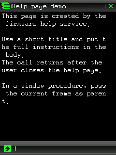
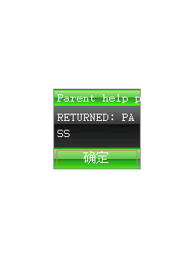

# 系统帮助页 API

`GUI+0x5a8` 是固件内建的同步帮助页服务。它创建带标题栏、正文区、滚动条和底部返回栏
的独立页面，并在页面关闭前接管自己的消息循环。公开接口位于
`sdk/include/bda_dialogs.h`：

```c
#include "bda_dialogs.h"

int bda_help_page(void *parent, const char *title, const char *body);
```



## 最小用法

```c
static const char help_body[] =
    "Use the arrow keys to scroll.\n"
    "Press ESC to return.\n";

int result = bda_help_page(0, "Game help", help_body);
if (result != BDA_HELP_PAGE_COMPLETED) {
    bda_msgbox("Game help", "HELP PAGE ERROR");
}
```

`parent=0` 已在裸 `bda_main()` 中验证。应用已有注册 Frame 时，可以把当前 Frame handle
作为 `parent`；独立 parent probe 已验证帮助页关闭后能恢复父 Frame，并继续显示 PASS
消息框：



`bda_help_page()` 返回值由 SDK 定义：

- `BDA_HELP_PAGE_COMPLETED`：参数检查和临时内存分配成功，固件帮助页调用已经返回。
- `BDA_HELP_PAGE_ERROR`：参数为空、标题不合法、标题过长、长度溢出或内存分配失败。

它不返回用户关闭方式。固件原始返回字节的意义尚未确定，因此公开 wrapper 会主动丢弃。

## 问号按钮边界

这个 API 只负责打开帮助页，**不会自动给调用者窗口添加问号按钮**。原版
`元素周期表.bda` 自己检测标题栏问号区域，把它转换为应用消息 `0x07fd`，再从窗口过程
调用 `GUI+0x5a8(frame, document)`。自定义应用也应在自己的按钮回调、命令消息或触摸
命中分支中调用 `bda_help_page()`；`0x07fd` 是该应用采用的命令号，不是必须使用的系统
帮助消息。

帮助页内部的标题栏、正文控件、滚动条和返回栏由固件服务创建，调用者不应释放它们。
调用返回后，调用者继续拥有自己的父 Frame，并按原窗口生命周期清理。

## 标题与正文

C200 原始 ABI 只接收一段 `title\r\nbody` 文档。固件在全局区准备 28 字节标题缓冲，
然后按首个 CRLF 拆分标题和正文；原始实现没有可靠的标题长度保护。SDK 因此：

- 要求 `title` 不包含 CR 或 LF。
- 按固件编码后的字节数限制为 `BDA_HELP_PAGE_TITLE_MAX_BYTES`，即 27 字节。
- 自动拼接 CRLF，并在同步调用返回后释放临时文档。
- `body` 可以包含换行；本次没有给正文长度声明未经验证的上限。

中文文本应按 BDA/固件实际使用的 GBK 字节处理，27 是字节数，不是汉字数。

## 静态证据

在 C200 固件中：

```text
GUI+0x5a8 table entry  0x80281408
target                 0x800db8d8
a0                     parent/frame
a1                     title + CRLF + body
```

目标函数通过 `0x800dbc90` 查找首个 `0x0d 0x0a`，创建标准 Frame 和正文控件，进入
`GUI+0x030/+0x050/+0x054` 形态的内部循环，最后释放自己的 Frame。除元素周期表外，
记事本、名片、电子图书、系统设置等大量原版 BDA 也调用同一表项，说明它是通用固件
服务，不是元素周期表的私有函数。

## 8013 动态验证

验证环境：`E:\bbk9588-emulator-v0.1.5`，端口 8013，独立
`runtime\bda_test\bbk9588_nand.bin`；没有修改 `C200.bin`。

两个独立探针和正式公开示例分别覆盖：

1. `parent=0`：页面显示后按退出键关闭，继续执行到 `RETURNED: PASS`。
2. 已注册 Frame parent：页面关闭后恢复父 Frame，再显示 `RETURNED: PASS`。
3. `example/system/help_page/HelpPage.bda`：直接运行公开 `bda_help_page()`，验证 SDK
   拼接、heap 临时文档、固件调用、返回后释放和 PASS 消息框。

parent probe BDA SHA-256：

```text
05007109f3be0f613b249c852e7f27fc8105f52af7eb55683684c7754bb097de
```

公开示例 BDA SHA-256：

```text
9a9559b64f585aa486c94305cfaef77b46ff3c6269bd63fc3706482a67a1a2cc
```

实时关闭链日志保存在
[`assets/help_page_probe_log.txt`](assets/help_page_probe_log.txt)。本次动态验证覆盖退出键关闭，
没有把标题栏触摸关闭和所有正文滚动操作声明为已验证行为；真机仍需复测。

公开示例：

```text
example/system/help_page/help_page_demo.c
example/system/help_page/HelpPage.bda
```

构建并部署：

```powershell
python -m bda_packer example\system\help_page\help_page_demo.c `
  --title HelpPage --category 9 `
  -o example\system\help_page\HelpPage.bda

.\scripts\test_bda_in_emulator.ps1 `
  .\example\system\help_page\HelpPage.bda -NoOpenBrowser
```
