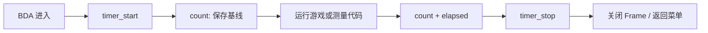

# 高分辨率计时 API

这组 API 已由 `HighResolutionTimerProbeV4.bda` 在 8013 模拟器和 BBK 9588 真机完成
`start/read/stop` 闭环。它提供标称 1 ms 的单调计数，适合游戏帧调度、输入节流和短区间
profiling，但不应当作精确墙钟或日历时间使用。

## 公开接口

包含 [`bda_time.h`](../../sdk/include/bda_time.h)：

```c
void bda_gui_millisecond_timer_start(void);
void bda_gui_millisecond_timer_stop(void);
u32 bda_gui_millisecond_count(void);
u32 bda_gui_millisecond_elapsed(u32 start, u32 end);
```

| 接口 | 固件入口 | 语义 |
|---|---|---|
| `bda_gui_millisecond_timer_start()` | GUI `+0x714` | 启动 TCU0 和 IRQ `0x17` |
| `bda_gui_millisecond_timer_stop()` | GUI `+0x718` | mask TCU0 并注销 IRQ |
| `bda_gui_millisecond_count()` | GUI `+0x71c` | 读取 IRQ 递增的 32-bit counter |
| `bda_gui_millisecond_elapsed()` | SDK helper | 用无符号减法计算 counter 差值 |

C200 中 `+0x714` 将 TCU0 配置为 external 12 MHz、`/16`、period 750；IRQ callback
`0x8001dec0` 每次把 `0x80473fd0` 加一。因此名义频率是 1000 Hz，计数单位是标称
1 ms。

## 生命周期

计时器占用固件的 TCU0/IRQ 资源，不是无状态 getter，也没有证据表明它支持嵌套或引用
计数。每次 BDA 只启动一次，并保证所有退出路径最终停止一次：



```c
#include "bda_time.h"

u32 started;
u32 elapsed;

bda_gui_millisecond_timer_start();
started = bda_gui_millisecond_count();

/* 游戏循环或待测代码。 */

elapsed = bda_gui_millisecond_elapsed(
    started, bda_gui_millisecond_count()
);
bda_gui_millisecond_timer_stop();
```

`start` 不会把全局 counter 清零：真机第一次读取是 `0x1c`。开发者必须在启动后保存
基线，再计算无符号差值。不要在 `start` 前或 `stop` 后依赖 counter，也不要连续调用
两次 `start`。32-bit 无符号差值可以跨一次回绕；按标称 1 ms 计算，完整回绕约为
49.7 天。

## 分辨率与误差

真机 V4 在同一个 25 ms GUI tick 内观察到 counter 从 959 增到 960，因此确认它能分辨
小于 25 ms 的时间变化。四个名义 200 ms 窗口的结果为：

| 窗口 | 25 ms ticks | timer count 差值 |
|---:|---:|---:|
| 0 | 8 | 200 |
| 1 | 8 | 194 |
| 2 | 8 | 194 |
| 3 | 8 | 194 |

这说明“标称 1 ms 粒度”不等于“墙钟误差不超过 1 ms”。当前动态证据不能确定偏差来自
两个固件 timer 的实际频率、边界采样还是 IRQ 调度，因此 SDK 不承诺计数与真实毫秒
严格相等。游戏应使用差值和 deadline 比较，并容忍少量抖动；需要长期准确时间时仍应
使用系统日期/时钟能力，而不是累计该 counter。

## 动态证据

真机完整日志保存在
[high_resolution_timer_v4_hardware_log.txt](assets/high_resolution_timer_v4_hardware_log.txt)。关键闭环：

```text
SUBTICK=PASS TICK=197589 M0=959 M1=960 POLLS=3509
TIMER STOPPED
STOP CHECK TICKS=2 C0=1017 C1=1017
FAILURES=0x00000000
RESULT=PASS
```

停止后又经过两个 25 ms tick，counter 仍为 1017，证明 V4 没有遗留活动 timer。8013
模拟器四个窗口均为 200，subtick 和 stop 检查同样通过。

## 示例与验证边界

- 公开示例：`example/system/high_resolution_timer/high_resolution_timer_demo.c`
- 真机探针：`reverse/examples/high_resolution_timer_probe.c`
- 真机产物：`build/HighResolutionTimerProbeV4.bda`
- 日志路径：`A:\HRTIMER.TXT`
- 固件绑定：`kj409588/C200` 的 GUI 动态函数表

验证没有覆盖嵌套 start、多 BDA 并发占用、休眠期间计数、超过一次 `u32` 回绕，或其他
机型和固件版本。直接读取 TCU MMIO 和 CP0 Count 的 V2 路径已在真机失败，不属于公开
API。
