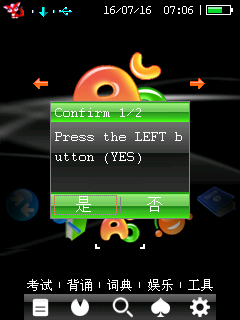
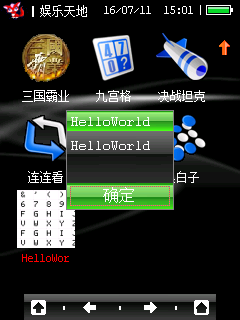
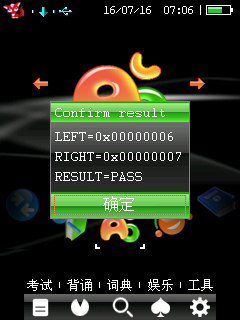

# Message Box 与确认框 API

## 已验证接口

```c
int bda_msgbox(const char *title, const char *message);
int bda_msgbox_ex(void *parent, const char *title, const char *message, u32 flags);
int bda_confirm(const char *title, const char *message);
```

公开的类型和返回值常量：

```c
#define BDA_MSGBOX_TYPE_OK      0u
#define BDA_MSGBOX_TYPE_YES_NO  2u
#define BDA_DIALOG_RESULT_YES   6
#define BDA_DIALOG_RESULT_NO    7
```

固件绑定信息：

```text
SDK macro       BDA_GUI_MSGBOX
runtime table   GUI +0x2b8
table slot VA   0x80281118
system function 0x800c6544
```

C200 的实际参数顺序是 `parent,message,title,flags`。SDK wrapper 对开发者公开
`title,message` 顺序，并在内部完成转换。单按钮消息框最小用法：

```c
#include "bda_sdk.h"

__attribute__((section(".text.bda_main")))
int bda_main(void) {
    bda_msgbox("HelloWorld", "HelloWorld");
    return 0;
}
```

是/否确认框使用同一个固件表项，只是第四参数改为 `2`。通常直接调用
`bda_confirm()`：

```c
int result = bda_confirm("Confirm", "Delete this file?");
if (result == BDA_DIALOG_RESULT_YES) {
    /* 执行删除。 */
} else if (result == BDA_DIALOG_RESULT_NO) {
    /* 保留文件。 */
}
```



## 注意点

- `title` 和 `message` 必须在调用期间保持有效，并以 NUL 结尾。
- 单按钮消息使用 `parent=0, flags=BDA_MSGBOX_TYPE_OK`，即 `bda_msgbox()`。
- 是/否确认使用 `parent=0, flags=BDA_MSGBOX_TYPE_YES_NO`，即 `bda_confirm()`。
- 8013 已动态确认“是”返回 `6`、“否”返回 `7`；不能把返回值直接当作布尔值，
  因为两个结果都非零。
- 非空 `parent`、按实体退出键关闭确认框时的返回值，以及其他非零 `flags` 仍未验证。
- Message box 自己建立模态 GUI，不要求应用预先创建 window/frame，适合作为新
  standalone BDA 的第一个系统 API smoke。

## 单按钮动态验证

测试源码是 `example/basic/hello_world/hello_world_msgbox.c`。构建命令：

```powershell
python -m bda_packer example\basic\hello_world\hello_world_msgbox.c `
  --title HelloWorld `
  --category 9 `
  -o example\basic\hello_world\HelloWorld.bda

python -m bda_packer.validate example\basic\hello_world\HelloWorld.bda
```

当前预编译样例大小为 `38488` byte，entry file offset 为 `0x95f8`，运行 VA 为
`0x81c00020`，SHA-256 为
`54ECDB37508C7CF3B183476CE314FDC1BD1B353BC0381DF5C0BC9A545FC57DCB`。

动态验证时使用的是相同源码生成的 category 4 测试包，并额外带测试图标；该历史包
SHA-256 为 `A91EF6F90A2CE32E7F4F1CEB31E4CDCAC3499F4A8B630DD03BA9DFA45E9E0B60`。
验证使用原版 NAND 的 frontend persistent worker copy。BDA 只通过
`/api/files/import` 写入，通过 `/api/files/export` 导出后哈希与本地生成物一致。
category 4 原有菜单已经达到 10 项；新增第 11 个文件不会展示。将同一生成物临时放入
已知 category 4 菜单路径后，菜单显示自定义图标和 `HelloWorld` 标题，点选后弹出：



QEMU 在弹窗显示后保持 `running=true`、`stop_reason=null`。测试完成后已通过文件 API
恢复被临时替换的 worker 文件；原版 NAND SHA-256 保持
`0D01C5A1B547419E0E76CB8BAF9AA1951FEC27B4629033D33EFEB99C3C97F103`。

## 是/否动态验证

测试源码和预编译产物位于：

```text
example/system/confirm_dialog/confirm_dialog_probe.c
example/system/confirm_dialog/ConfirmDialog.bda
```

构建和部署命令：

```powershell
python -m bda_packer example\system\confirm_dialog\confirm_dialog_probe.c `
  --title Confirm --category 9 `
  -o example\system\confirm_dialog\ConfirmDialog.bda

.\scripts\test_bda_in_emulator.ps1 `
  .\example\system\confirm_dialog\ConfirmDialog.bda -NoOpenBrowser
```

验证环境为 `E:\bbk9588-emulator-v0.1.5` 的 8013 完整 NAND 模式，测试脚本只替换
专用 `runtime\bda_test` 副本中的 `A:\应用\程序\宠物单词.bda`。探针先要求点击左侧
“是”，再要求点击右侧“否”，最后显示两个原始返回值：



结果为 `LEFT=0x00000006`、`RIGHT=0x00000007`、`RESULT=PASS`。完成两次选择后
QEMU 保持 `running=true`、`stop_reason=null`、`invalid=0`，证明 `flags=2` 的按钮布局、
两个返回值和连续模态调用均形成动态闭环。

当前预编译 `ConfirmDialog.bda` 大小为 `0x98e8`，SHA-256 为
`5D8ECBC22D01940BAB721ECB9A957BF70E0FB69430F9403722EAC40C2A4AADF0`。

## 验证边界

本页证明 standalone header、VX icon、flat code loader 和 `GUI+0x2b8` 的单按钮及
是/否模态路径可以共同工作。它不证明其他 GUI wrapper、window lifecycle、确认框的
退出键返回值或尚未映射的其他布局已经可用。
