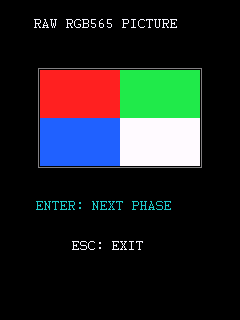
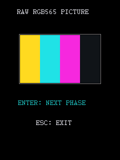
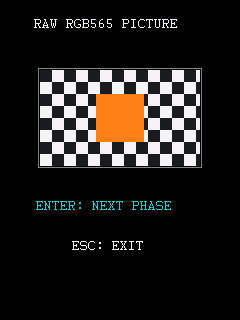

# 原始 RGB565 Picture 提交 API

验证环境：`bbk9588-emulator-v0.1.5`，8013 端口，完整 NAND 冷启动，固件
`kj409588/C200`。

验证等级：模拟器稳定公开；BBK 9588 真机仍需复测。公开范围仅限原生尺寸的 raw
RGB565 提交，不包含图片解码、缩放、旋转或所有 descriptor mode。

独立准入探针：`reverse/examples/gam4980_picture_api_probe.c`。

公开示例：`example/graphics/picture_render/picture_render_demo.c`。

## 公开 API

```c
int bda_gui_render_picture(
    bda_handle_t context,
    s32 x,
    s32 y,
    s32 width,
    s32 height,
    const bda_gui_picture_t *picture
);
```

固件入口是 GUI `+0x410`。本次三次成功调用均返回 `0`。

`bda_gui_picture_t` 的 ABI 固定为 28 byte：

| 偏移 | 字段 | 本次 raw RGB565 用法 |
|---:|---|---|
| `+0x00` | `pixels` | 必须为 `0` |
| `+0x04` | `width` | source width |
| `+0x08` | `height` | source height |
| `+0x0c` | `stride_bytes` | 必须为 `0` |
| `+0x10` | `mode10` | 必须为 `0` |
| `+0x11` | `bits_per_pixel11` | 必须为 `0` |
| `+0x12` | `internal12` | 必须为 `0` |
| `+0x13` | `internal13` | 必须为 `0` |
| `+0x14` | `source_pixels` | little-endian RGB565 pixel buffer |
| `+0x18` | `selected_index` | 必须为 `-1` |

先清零整个结构，再只设置已验证字段：

```c
static u16 pixels[160 * 96];
static bda_gui_picture_t picture;

bda_memset(&picture, 0, sizeof(picture));
picture.width = 160;
picture.height = 96;
picture.source_pixels = pixels;
picture.selected_index = -1;
```

`source_pixels` 采用逐行连续的 RGB565，长度至少为 `width * height * 2`。buffer 在调用
返回前必须保持有效；接口不接管、不分配也不释放该内存。

## 提交生命周期

目标必须是 active frame 的有效 draw context。向 visible context 提交时，使用完整 draw
guard，并临时选择 kind 7 draw object：

```c
void *old_object;
int result;

(void)bda_gui_draw_guard_begin();
old_object = bda_gui_select_draw_object(visible, draw_object);
result = bda_gui_render_picture(
    visible, 40, 70, 160, 96, &picture
);
(void)bda_gui_select_draw_object(visible, old_object);
(void)bda_gui_draw_guard_end();

if (result != 0) {
    /* submission failed */
}
```

本次只验证 `width/height` 与 descriptor 尺寸相等。不要依据函数参数推断任意缩放已经
稳定，也不要省略 `bda_gui_current_draw()` / `bda_gui_end_draw()` 所有权配对。

## 三阶段动态验证

准入 BDA 在同一个 visible draw context 和同一个 descriptor 上连续提交三次，每次只
改写 `source_pixels` 内容：

1. 红、绿、蓝、白四象限。
2. 黄、青、洋红、深灰四条竖带。
3. 黑白棋盘和橙色中心块。







宿主对三张 `screen.png` 做 RGB 像素比较：phase 0 与 phase 1/2 的差异 bbox 都精确为
`(40,70,200,166)`，变化像素均为 `15360 = 160 * 96`；区域外没有变化。抽样颜色也与
RGB565 转换结果逐点一致。

探针 BDA SHA-256：

```text
5f9a63ec0c75a0488db6c22fa81503f00be636c099ec58c9ef38ad59a5d8a9b9
```

模拟器原始导出日志（CRLF 字节）SHA-256：

```text
4bda88ee59db295d2b2af679dd8a1ace98b94ce6bb216741d6887d223ba448f5
```

完整日志保存在 [picture_render_probe_log.txt](assets/picture_render_probe_log.txt)；Git
按仓库规则将该文本规范化为 LF，因此检出文件的字节哈希不同。日志中三次
`RETURN=0`，最终记录 `THREE_PHASES=PASS`。实体 Escape 后通过模拟器安全关机，NAND
校验仍通过。

## 与 VX 路径的区别

`bda_gui_draw_vx()` 接受带 24-byte VX header 的完整资源块；
`bda_gui_render_picture()` 接受独立 descriptor 和裸 RGB565 buffer。对每帧都已存在于
内存中的 160×96 LCD framebuffer，后者省去重建全屏 VX 和 compatible context copy，
适合 gam4980 的动态 LCD 区域。

这不代表 picture API 在所有场景都更快。静态背景、精灵合成、色键和 dirty rect 仍应
使用 [game_rendering_api.md](game_rendering_api.md) 已验证的 VX/compatible context 路径。

## 已知边界

- 只验证 `kj409588/C200` 模拟器完整固件路径，真机仍需复测。
- 只验证 native-size `160x96` raw RGB565；缩放、裁剪和非 16-bit source 未验证。
- `stride_bytes`、mode、bits-per-pixel 和内部字段的非零值未验证，必须保持为零。
- `pixels` 非零和 `selected_index != -1` 属于其他 backend 路径，仍保留在研究范围。
- 未验证 decoder 输出、图片资源释放 helper、旋转、alpha blending 或色键。
- visible 提交必须位于完整 draw guard 中，source buffer 由应用持有。
