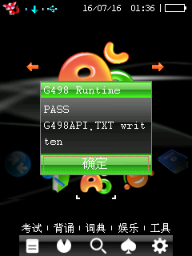

# 堆、文件定位与目录 API

验证环境：`bbk9588-emulator-v0.1.5`，8013 端口，完整 NAND 冷启动，固件
`kj409588/C200`。

验证等级：模拟器稳定公开；BBK 9588 真机仍需复测。本文不把模拟器结论扩张到其他
机型或固件。

独立准入探针：`reverse/examples/gam4980_runtime_api_probe.c`。

公开示例：`example/system/runtime_services/runtime_services_demo.c`。

## 公开 API

| 公开函数或常量 | 固件入口 | 已验证语义 |
|---|---:|---|
| `bda_alloc()` | MEM `+0x008` | 按 byte 数分配，成功返回可读写指针 |
| `bda_free()` | MEM `+0x00c` | 释放一次成功分配的指针 |
| `bda_fs_seek_raw()` | FS `+0x010` | 成功返回更新后的绝对位置，失败返回 `-1` |
| `BDA_SEEK_SET` | `0` | 从文件开头定位 |
| `BDA_SEEK_CUR` | `1` | 从当前位置定位，支持负偏移 |
| `BDA_SEEK_END` | `2` | 从文件末尾定位 |
| `bda_fs_chdir()` | FS `+0x02c` | 切换当前目录；本次成功返回 `0` |
| `bda_fs_mkdir()` | FS `+0x030` | 创建目录；干净 NAND 上成功返回 `0` |
| `bda_fs_findfirst()` | FS `+0x03c` | 打开枚举并写回第一项 |
| `bda_fs_findnext()` | FS `+0x040` | 写回下一项；结束返回 `-1` |
| `bda_fs_findclose()` | FS `+0x044` | 释放枚举 cursor；本次成功返回 `0` |
| `bda_fs_find_data_init()` | 纯 SDK helper | 把 0x220-byte 枚举结构清零 |
| `bda_memcpy()` | 纯 SDK helper | freestanding byte copy，不调用固件 |

公开名称不带 `_like`。`calloc`、`realloc`、删除目录、重命名等入口没有随本次验证
一并公开。

## 堆所有权

`bda_alloc()` 的参数是 byte 数。每个成功返回的指针必须与一次 `bda_free()` 配对；
不要释放静态区、栈指针、固件 object handle 或 compatible draw context。

准入探针同时保留了 gam4980 实际需要的六块内存：

```text
0x8000
0x200000
0x200000
0x200000
161 * 96 * 2
24 + 240 * 320 * 2
```

探针对每个 4 KiB 边界、中点和末 byte 写入不同标记，并检查所有地址区间不重叠。
按逆序释放后，又成功分配和读写了一个 4096-byte block。

```c
u8 *buffer = (u8 *)bda_alloc(4096u);
if (!buffer || (u32)buffer == 0xffffffffu) {
    /* allocation failed */
}

buffer[0] = 0x5a;
bda_free(buffer);
buffer = 0;
```

本次没有验证 `bda_free(NULL)`、重复释放、超大分配失败值或内存耗尽恢复。应用应只把
成功分配且尚未释放的指针传给 `bda_free()`。

## Seek

成功 seek 的返回值就是新位置，不是固定的 `0`：

```c
int size = bda_fs_seek_raw(file, 0, BDA_SEEK_END);
if (size < 0 || bda_fs_tell_raw(file) != size) {
    /* seek failed */
}

if (bda_fs_seek_raw(file, 4, BDA_SEEK_SET) != 4) {
    /* position mismatch */
}
```

动态结果为：`END -> 16`、`SET 4 -> 4`、从位置 8 执行 `CUR -2 -> 6`。随后分别读回
`4567` 和 `67`。非法 `whence=99` 返回 `-1`。

## 目录与枚举

路径使用与 `bda_fs_fopen_raw()` 相同的 ASCII/GBK byte string。相对路径依赖当前目录，
因此应用退出或启动其他模块前应切回明确目录。

```c
bda_fs_find_data_t find_data;
int result;
int opened;

if (bda_fs_chdir(data_directory) == -1) {
    /* directory unavailable */
}

bda_fs_find_data_init(&find_data);
result = bda_fs_findfirst("*.gam", 0x27u, &find_data);
opened = result != -1;
while (result != -1) {
    find_data.name_or_path[sizeof(find_data.name_or_path) - 1u] = 0;
    /* consume find_data.name_or_path */
    result = bda_fs_findnext(&find_data);
}
if (opened)
    (void)bda_fs_findclose(&find_data);
```

只对成功打开的枚举调用一次 `bda_fs_findclose()`。`bda_fs_find_data_t` 必须保持完整的
0x220 byte，不能用较短的
自定义 buffer 替代。

## 动态证据

测试使用基础 NAND 新建并补 ECC 的 worker copy：

```text
E:\bbk9588-emulator-v0.1.5\runtime\bda_test\bbk9588_nand_gam4980_api_verify_ecc.bin
```

原始 `bbk9588_nand.bin` 未修改，legacy Python storage/resource hooks 均关闭。探针在
`A:\应用\数据\游戏\G498API` 创建两个相对路径文件，结果导出到 `G498API.TXT`。

探针 BDA SHA-256：

```text
7efd51d825633858456455ec8c1a058fcd34d2a90327a92633208e0071eff0ef
```

模拟器原始导出日志（CRLF 字节）SHA-256：

```text
6ac2fc57342a89fe0ae4682dc7fd58a4021502053829a7e29c60e46d7184e796
```

完整日志保存在 [runtime_services_probe_log.txt](assets/runtime_services_probe_log.txt)；
Git 按仓库规则将该文本规范化为 LF，因此检出文件的字节哈希不同。屏幕同时显示 PASS：



安全关机后 NAND 校验仍通过，目录中恰有 `ONE.TST` 16 byte 和 `TWO.TST` 11 byte。

## 已知边界

- 只验证 `kj409588/C200` 模拟器完整固件路径，真机仍需复测。
- `findfirst` 的 `attr=0x27` 只验证普通测试文件枚举，没有完整命名每个属性 bit。
- 没有验证跨 volume、长 GBK 文件名截断、并发枚举或目录被同时修改。
- 没有验证 seek 到负位置、超过文件末尾后的写入或大于 2 GiB 的位置。
- 堆测试覆盖 gam4980 所需的约 6.5 MiB 同时分配，不代表任意内存压力都可恢复。
