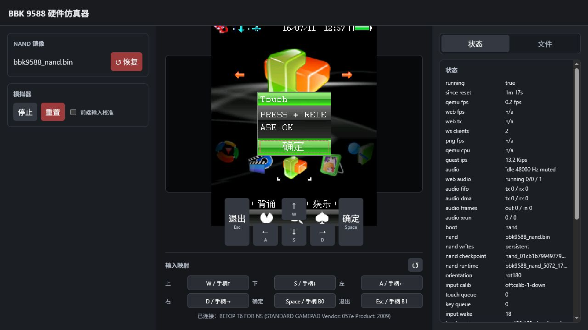

# 固定地址触摸状态实验失败记录

本文保留早期 `TouchPress.bda` 的兼容模拟器实验，不能作为公开 API 的验证依据。

早期研究镜像中，地址 `0x80059f68` 是一个读取 `0xb0010100` bit `0x00040000` 的
短函数。旧模拟器兼容补丁把该路径映射到 touch latch，因此实验曾观察到
`PRESS=1 RELEASE=1`：

2026-07-21 的真机隔离推翻了固定地址兼容假设：

- `FastTouchV2` 在第一次调用 `0x80059f68` 后停止，日志停在 `BEFORE FIRST PEN`。
- `FastTouchV3` 只读该地址的指令字，得到
  `3C018049 AC20FD40 3C018049 AC20FD44 3C018049 AC20FD48`，与研究镜像中的
  GPIO leaf function 完全不同。
- V3 直接读取 `0xb0010100` 时始终得到 `0x0D527220`，目标 bit 始终为 0，不能区分
  按下和抬起。

结论：`bda_touch_pressed_9588()` 已从 `sdk/include` 删除。固定虚拟地址既不是运行时
函数表 ABI，也不能跨固件布局使用。历史源码和 BDA 分别保存在
`reverse/examples/touch_press_fixed_va_probe.c` 与
`reverse/examples/TouchPressFixedVaProbe.bda.failed`，仅用于复现失败边界，禁止在真机运行。

真机可用的高速坐标读取见公开文档 `docs/verified/touch_position_api.md`；按下和抬起状态
仍由窗口消息 `1/2` 维护。
