# 游戏系统 API 验证进度

更新时间：2026-07-16

> 研究头兼容说明：`sdk/api/bda_sdk.h` 暂时保留
> `bda_gui_tick_count_25ms_like()`、`bda_gui_tick_elapsed_25ms_like()`、
> `bda_gui_tick_elapsed_ms_like()` 和
> `BDA_GUI_COLOR_KEY_MAGENTA_RGB565_LIKE`，仅用于复现实验记录。普通应用应使用
> `sdk/include/bda_sdk.h` 中不带 `_like` 的稳定名称。

本文记录为原生 BDA 游戏补齐系统 API 的动态验证进度。结论严格区分三种证据：

- **静态确认**：C200 或原机 BDA 反汇编已经确认入口和参数边界。
- **模拟器通过**：在 `bbk9588-emulator-v0.1.5` 的完整 NAND 固件路径运行通过。
- **真机通过**：在 C200 真机形成可重复闭环后，才能进入 `sdk/doc/verified/`。

模拟器通过不自动等于真机通过，也不会让全部候选 API 自动进入公开 SDK。V6/V8/V9、
V19-V21 和完整扫雷闭环重复确认的 compatible context、VX、context copy、洋红色键、
dirty rect 与 25 ms tick 已按“模拟器稳定”等级进入 `sdk/include/bda_sdk.h`；验证环境仍
明确标注为 8013，真机栏保持待测。其余 probe 继续只访问逆向研究 header。

## 总表

| 能力 | API / 候选入口 | 静态证据 | 模拟器 | 真机 | 当前结论 |
|---|---|---:|---:|---:|---|
| 固件堆分配 | MEM `+0x008/+0x00c` | 是 | V1 两次通过 | 待测 | 64 byte 至 4 MiB 可写并可释放 |
| 清零分配 | MEM `+0x010` | 是 | V1 两次通过 | 待测 | `32 * 16` byte 全部为零 |
| 调整分配 | MEM `+0x014` | 是 | V1 两次通过 | 待测 | `128 -> 4096 -> 64` 数据保持 |
| 显示参数 | GUI `+0x300` | 是 | V1 两次通过 | 待测 | `240*320`、16 bpp、2 bytes/pixel |
| 阻塞延时 | SYS `+0x080` | 是 | 已有使用 | 真机已有使用 | 是 busy-wait，不是游戏 tick |
| 单调计时 | GUI `+0x6d8` | 是 | V9 通过 | 待测 | 32-bit raw tick，周期 25 ms；elapsed 用无符号差值 |
| 窗口定时消息 | GUI `+0x1ac/+0x1b0` + 静态框架 | 部分 | 待重建 | 待测 | 表入口只发送 `0x162/0x163`，调度在原机根窗口框架 |
| 批量绘图 | GUI `+0x3f8/+0x400` 调用链 | 部分 | 暂停危险探针 | 真机失败过 | 缺少原机 game surface/context 生命周期 |
| 字体指标 | GUI `+0x4a4/+0x4d0/+0x4d4` | 是 | V3 通过 | 待测 | 当前字体有效，cell 为 `16*16` |
| frame client rect | GUI `+0x0a4` | 是 | V3 通过 | 待测 | 有效 frame 返回 `(0,0)-(240,320)` |
| VX 图片/精灵 | GUI `+0x540` | 是 | V3 通过 | 待测 | 运行时生成的 48x48 VX 一次完整显示 |
| 填充矩形 | GUI `+0x334/+0x38c` + kind 8 | 部分 | V3 未证实 | 待测 | 只显示轮廓，不能把 `+0x334` 命名为 fill rectangle |
| 折线 | GUI `+0x384` | 是 | V10 通过 | 待测 | `context,point_array,count`，连续折线和闭合路径均可见 |
| 椭圆轮廓/填充 | GUI `+0x390` | 是 | V11 通过 | 待测 | `context,cx,cy,rx,ry,0,0,filled`，末项 0/1 切换轮廓/实心 |
| 圆弧 | GUI `+0x394` | 是 | V12 通过 | 待测 | `context,cx,cy,start_deg,end_deg,radius`；0→180 为上半圆 |
| 圆角矩形 | GUI `+0x398` | 是 | V12 通过 | 待测 | 中心坐标、宽高、x/y 圆角半径和 filled；轮廓/实心均可见 |
| 逻辑坐标映射 | GUI `+0x3a0..+0x3c4` | 是 | V13 通过 | 待测 | map mode + viewport/window origin/extent getter/setter；2 倍映射正确且状态可恢复 |
| point 坐标转换 | GUI `+0x3c8..+0x3d4` | 是 | V14 通过 | 待测 | full pair 包含 context origin，map-only pair 不包含；已知值和双向 round-trip 正确 |
| clip 矩形排除 | GUI `+0x3d8` | 是 | V16 通过 | 待测 | 从 region 扣除矩形；相交节点拆成最多四个条带，中央 hole 查询和绘图正确 |
| clip 矩形并集 | GUI `+0x3dc` | 是 | V17 通过 | 待测 | 去除旧节点重叠后追加矩形；多节点查询/绘图正确，cached bounds 不扩展 |
| clip 矩形交集 | GUI `+0x3e0` | 是 | V18 通过 | 待测 | 逐节点与输入矩形求交并清理空节点；多节点绘图正确，aggregate bounds 重新计算 |
| clip 选择/恢复 | GUI `+0x3e4` | 是 | V15 通过 | 待测 | 非空矩形设置自定义裁剪；NULL 清除 region，绘图和命中回退到完整 context bounds |
| clip 边界/命中查询 | GUI `+0x3ec/+0x3f0/+0x3f4` | 是 | V10/V15 通过 | 待测 | `+0x3ec` 读 custom region；reset 后为零哨兵，命中查询使用 effective clip |
| VX/BMP decode | GUI `+0x670` | 是 | V4/V5 通过 | 待测 | 两种 descriptor layout 和释放责任已区分 |
| decoded BMP render | GUI `+0x410` | 是 | V5 通过 | 待测 | 32x32 RGB565 decode buffer 正确显示 |
| compatible context copy | GUI `+0x310/+0x418/+0x314` | 是 | V6/V8/V19-V21 通过 | 待测 | 三块 compatible surface 可同时存在；支持 hidden->hidden 合成/恢复和 hidden->visible present |
| 双缓冲精灵 | GUI `+0x540/+0x310/+0x418/+0x074` | 是 | V19-V21 通过 | 待测 | sprite->back 后单次 back->visible；不透明与色键透明动画均无残影 |
| RGB565 color key | GUI `+0x418` 末参数 | 是 | V20/V21 通过 | 待测 | 0 禁用透明键；0xf81f 跳过洋红 source pixel，alpha 待测 |
| dirty rectangle 局部提交 | GUI `+0x418/+0x074` | 是 | V21 通过 | 待测 | clean 恢复旧区域，back 合成新位置，只提交新旧位置的最小外接矩形 |
| PCM 音频写入 | SYS `+0x06c/+0x074/+0x078` | 是 | V2 通过 | 待测 | 22050 Hz/16-bit/mono，8 批均消费 1024 byte |
| PCM 音频清理 | SYS `+0x0a0/+0x08c` | 部分 | V2 未闭环 | 待测 | 调用返回后 DMA 仍运行，不能命名为 stop/close |
| JPEG decode | GUI `+0x808` | 是 | V7 通过 | 待测 | mode 0/1 均解码官方 JPEG，独立 source 可渲染并释放 |
| 安全存档 | FS seek/rename/mkdir/stat | 部分 | 待测 | 待测 | 基础 open/read/write/close 已真机验证 |

## GameApiProbeV1

源码：`reverse/examples/game_api_probe.c`

输出：`A:\应用\数据\游戏\GAMEAPI.TXT`

构建目标：`build/GameApiProbeV1.bda`

测试内容：

1. `GUI+0x300` 查询 metric `0..7`，检查 metric 6 为正数、metric 7 返回 `-1`。
2. 读取 MIPS CP0 Count，并在 `SYS+0x080` 延时 `1/100/1000` 前后记录差值。
3. `MEM+0x008/+0x00c` 依次申请并释放 64 byte 至 4 MiB，写读首部、中部和尾部。
4. `MEM+0x010` 验证 `32 * 16` byte 分配区域全部清零。
5. `MEM+0x014` 验证 `128 -> 4096 -> 64` byte 调整后原数据保持。
6. 每条结果立即 append 并关闭日志文件，异常时保留最后完成阶段。

运行环境：`bbk9588-emulator-v0.1.5`，端口 8013，专用
`runtime/bda_test/bbk9588_nand.bin`。

构建和部署命令：

```powershell
python -m bda_packer reverse\examples\game_api_probe.c `
  --title GameApiV1 --category 9 -o build\GameApiProbeV1.bda
.\scripts\test_bda_in_emulator.ps1 .\build\GameApiProbeV1.bda -NoOpenBrowser
```

部署脚本只替换专用 NAND 中的 `A:\应用\程序\宠物单词.bda`，并通过固定首页入口
自动启动；不会修改 `C200.bin` 或模拟器主 NAND。

运行结果：`FAILURES=0`，`RESULT=PASS`，程序执行完成后正常返回菜单。

关键结果：

```text
METRIC 0=0x00010000
METRIC 1=0x000000F0
METRIC 2=0x00000140
METRIC 3=0x000000EF
METRIC 4=0x0000013F
METRIC 5=0x00000010
METRIC 6=0x00000002
METRIC 7=0xFFFFFFFF
DELAY 1    COUNT_DELTA=0x00000567
DELAY 100  COUNT_DELTA=0x0002114F
DELAY 1000 COUNT_DELTA=0x0014AF3D
SIZE=4194304 PTR=0x80FA3DA8 EDGE=PASS
CALLOC ZERO=PASS
REALLOC GROW_PRESERVE=PASS
REALLOC SHRINK_PRESERVE=PASS
```

同日按上述正式命令从 `reverse/examples` 重建并复测，显示和内存结果完全一致，
仍为 `FAILURES=0`。三档 Count 差值分别为：

```text
DELAY 1    COUNT_DELTA=0x00000ACD
DELAY 100  COUNT_DELTA=0x0004229F
DELAY 1000 COUNT_DELTA=0x0014AF3D
```

部署记录中的 BDA SHA-256 为
`1b5cde2917089c5abbb718650667be985ebec52d7d48c6d9b1d36e3e8b82db89`；
replace helper 报告的 `C200.bin` SHA-256 仍为
`02a16107b11a3281067871c6fe3d4c289c910d8dfa9924573dd87f00351d6525`。

解释：metric `1/2` 对应 240/320，metric `3/4` 对应最大坐标 239/319，metric `5`
为 16 bit，metric `6` 为 2 bytes/pixel。CP0 Count 在三档 busy-wait 前后都递增，
但两次运行中短延时的差值并不稳定，不能直接用作毫秒换算。它目前只作为后续
计时研究的单调硬件计数基线。

## 雷霆窗口定时器静态对照

配套源码调用 `WinStartTimer(win, interval)`，雷霆 BDA 中对应静态 wrapper
`0x81c10060`。它实际执行：

```text
GUI+0x1ac(root_object, win, interval)
```

`WinStopTimer` 对应静态 wrapper `0x81c1009c`：

```text
GUI+0x1b0(root_object, win_or_timer)
```

C200 已确认 `+0x1ac/+0x1b0` 只同步发送内部消息 `0x162/0x163`。定时器列表、
周期推进和 `WM_TIMER` 转发属于雷霆静态链接的根窗口框架，不能只给这两个表入口
改名就得到通用系统定时器。后续要重建该框架，或者基于 CP0 Count 在 SDK 实现独立
游戏时钟。

## GameAudioProbeV2

源码：`reverse/examples/game_audio_probe.c`

输出：`A:\应用\数据\游戏\GAMEAUDIO.TXT`

构建目标：`build/GameAudioProbeV2.bda`

构建和部署命令：

```powershell
python -m bda_packer reverse\examples\game_audio_probe.c `
  --title GameAudioV2 --category 9 -o build\GameAudioProbeV2.bda
.\scripts\test_bda_in_emulator.ps1 .\build\GameAudioProbeV2.bda -NoOpenBrowser
```

测试内容：

1. 按 GAMEBOY 原始调用形态执行 `SYS+0x06c(22050, 16, 1)`。
2. 轮询 `SYS+0x074` ready，并通过 `SYS+0x078` 分批写入 16-bit mono PCM。
3. 记录每批等待次数和实际消费 byte 数。
4. 调用 `SYS+0x0a0` flush，最后用 `SYS+0x08c` reset/close，并确认 BDA 返回。

运行结果：PCM 写入通过，退出清理未闭环。BDA 日志完整结束且没有固件崩溃：

```text
STATE BEFORE=0x80362830
READY BEFORE=0x00000000
OPEN RETURNED
READY AFTER=0x00000001
WRITE 0..7 POLLS=0 BYTES=0x00000400
FLUSH RETURNED
RESET RETURNED
FAILURES=0x00000000
RESULT=PASS
```

模拟器后端同时观察到：

```text
sample_rate_hz=22050
received_packets=807
received_bytes=1423636
dma_completion_count=8
dma_rearm_count=7
dropped_packets=0
```

这足以确认 `open/ready/write` 的参数和 1024-byte PCM 提交闭环。它还暴露了一个
必须保留的反例：执行 `SYS+0x0a0` 和 `SYS+0x08c` 后，模拟器仍报告
`playing=true`、`timer_running=true`，并继续产生 underrun packet。因此：

- `SYS+0x0a0` 当前只能称为 flush/config helper，不能称为 stop。
- `SYS+0x08c` 会处理 `0x80362830` 中的 system resource id 后重新初始化内部状态，
  不能单独当作 raw PCM close。
- 在真正的停止顺序恢复前，游戏 SDK 不能公开“完整音频生命周期已验证”的结论。
- 本次探针结束后通过模拟器 reset 停止专用 NAND 的残留 DMA，不把该状态带入后续测试。

## GameGraphicsProbeV3

源码：`reverse/examples/game_graphics_probe.c`

输出：`A:\应用\数据\游戏\GAMEGFX.TXT`

构建目标：`build/GameGraphicsProbeV3.bda`

构建和部署命令：

```powershell
python -m bda_packer reverse\examples\game_graphics_probe.c `
  --title GameGfxV3 --category 9 -o build\GameGraphicsProbeV3.bda
.\scripts\test_bda_in_emulator.ps1 .\build\GameGraphicsProbeV3.bda -NoOpenBrowser
```

本轮沿用 Touch V23 已闭环的 frame 生命周期，在有效 object-paint scope 中完成：

1. 绘制线、圆、矩形轮廓和多段文字，作为已验证 primitive 回归。
2. 查询当前 font pointer 和 cell width/height。
3. 查询有效 frame 的 client rect。
4. 选择 firmware draw object kind 8，设置 `GUI+0x334` fill color 后绘制矩形。
5. 在 BDA 内存中生成完整 48x48 VX header/pixel block，通过 `GUI+0x540` 绘制。
6. 使用实体退出键执行 `stop -> release -> event poll 结束 -> close -> return`。

关键日志：

```text
REGISTER=0x80963CB8
ACTIVATE=0x00000001
DRAW=0x804A60C0
OBJECT DRAW=0x804A6194
OBJECT7=0x00008410
OBJECT8=0x0000C618
RECT RESULT=0x00000001
RECT X0/Y0=0/0
RECT X1/Y1=240/320
FONT=0x80825A80
FONT CELL W=0x00000010
FONT CELL H=0x00000010
FILL OLD=0x0000FFFF
VX RETURN=0x00000000
DRAW COUNT=0x00000001
STOP=0x00000001
RELEASE=0x00000000
RESULT=PASS
```

`GUI+0x540` 的 return value 不是稳定成功计数；本轮的成功证据是有效 VX block 在
模拟器 framebuffer 中一次完整显示，颜色棋盘和两条白色对角线均可见，没有逐块刷新。

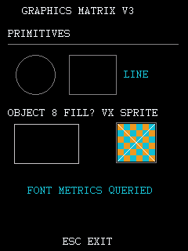

画面同时证明 primitives 和 ASCII text 在同一 object-paint scope 中正常。kind 8
矩形仍然只有轮廓，没有使用 `GUI+0x334` 的橙色填充，因此 `set_fill_color_like()`
目前只保留“写 context fill-color 字段”的含义，不能升级成填充矩形 API。

产物 SHA-256：

```text
07603df0ad3fc6a66600b7c48befe87aede943af30f4da6046f8b8136f379da8
```

## GameImageProbeV4-V6

源码：

```text
reverse/examples/game_image_probe.c         V4 decode/descriptor/cleanup gate
reverse/examples/game_image_render_probe.c  V5 decoded BMP render
reverse/examples/game_image_compat_probe.c  V6 compatible context copy
```

统一输出：`A:\应用\数据\游戏\GAMEIMG.TXT`

探针在应用自己的数据目录临时生成 32x32 VX 和标准 24-bit BMP。每次正常退出都会
释放 decoder/compatible context 资源，并删除 `GFXTEST.VX` 与 `GFXTEST.BMP`。

### V4：decode 和 ownership

V4 同时确认了 `GUI+0x670` 的两种成功 layout：

```text
[VX DESCRIPTOR]
OUT SOURCE=0x80964398
WIDTH/HEIGHT=32/32
STRIDE=64
MODE=0xCC
BPP=16
SOURCE PIXELS=OUT SOURCE+24
SELECTED=-1

[BMP DESCRIPTOR]
OUT SOURCE=0
WIDTH/HEIGHT=32/32
STRIDE=0
MODE=0
BPP=0
SOURCE PIXELS=0x809663FC
SELECTED=-1
```

两种 decode 都返回 `0`。V4 故意要求 BMP 也必须写 `stride/bpp`，因此最终
`RESULT=FAIL`；这是 descriptor 假设失败，不是 BMP decoder 失败。它证明不能把 VX
快路径写入的全部字段套到普通 BMP 路径。

清理顺序来自相册原始函数 `0x81c06a0c`：

- `out_source_buffer != 0`：调用 `MEM+0x00c(pointer)`，适用于 VX file buffer。
- `out_source_buffer == 0`：调用 `GUI+0x50c(picture)`；C200 证明该入口释放
  `picture+0x14`，适用于 BMP decoded source。

V4 两条释放路径都返回，frame 正常关闭。

### V5：decoded BMP render

V5 只按 `GUI+0x410` 实际读取的字段校验 BMP：`width`、`height`、
`source_pixels`、`selected_index`。随后执行：

```text
GUI+0x410(draw, 174, 76, 32, 32, &bmp_picture)
BMP RENDER RETURN=0
```

右侧红/青棋盘是普通 BMP 经 decoder 转为 RGB565 后的可见输出；`return=0` 仍不能
单独表示成功，可见 framebuffer 才是动态证据。

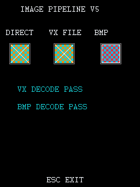

V5 最终日志为 `FAILURES=0`、`RESULT=PASS`，退出后两种 source 均已释放，临时文件已删除。

研究 header 现按该 ABI 提供 `bda_gui_render_picture_like()` 和
`bda_gui_picture_source_free_like()`；后者对应
`BDA_GUI_PICTURE_SOURCE_FREE_LIKE`。它们尚未进入 `sdk/include/bda_sdk.h`。

产物 SHA-256：

```text
4d9cd1be2948d44e4468bda0ce667f7b07dc31c02c53fe2637f58ec9e6cc8a4d
```

### V6：compatible context

V6 在 V5 基础上执行：

```text
GUI+0x310(visible_draw) -> compat=0x80963E7C
GUI+0x540(compat, 0, 0, vx)
GUI+0x418(compat, 0, 0, 32, 32, visible_draw, 104, 236, 0)
GUI+0x314(compat)
```

屏幕下方的 `COMPAT COPY` 图块证明复制方向必须是 source compatible context 在前、
visible destination 在第六参数。旧 V14/V15 的全屏白底实验不能据此命名为双缓冲；
V6 只确认一个 32x32 区域在有效 object-paint scope 中成功复制。

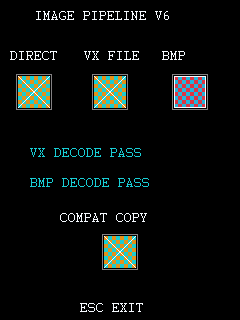

退出日志确认 `COMPAT FREED`、两种图片 source 已释放、`FAILURES=0`、`RESULT=PASS`。

研究 header 保留九参数 `bda_gui_context_copy_like()` 供历史 probe 使用；公开 SDK
提供唯一稳定名称 `bda_gui_context_copy()`，避免开发者再次猜错 destination context
的 stack 位置。

产物 SHA-256：

```text
7264c167236344d09a76fc24007782771b5400f1e6a43194838383a438322371
```

## GameJpegProbeV7

源码：`reverse/examples/game_jpeg_probe.c`

输出：`A:\应用\数据\游戏\GAMEJPG.TXT`

V7 使用官方 NAND 相册中的 `A:\应用\我的相册\gcddh.jpg`，分别调用：

```text
GUI+0x808(draw, &mode0_picture, path, 0)
GUI+0x808(draw, &mode1_picture, path, 1)
```

两次调用都返回 `0`，descriptor 都是 `300x300`、`selected_index=-1`，但
`source_pixels` 分别为 `0x80FE9BE8` 和 `0x81015B08`。`stride/mode/bpp` 均为零，
再次证明普通 decoder 输出不能按 VX 快路径字段校验。

V7 随后用 `GUI+0x410` 把两张图分别缩放到 `100x100`；两种 mode 的可见结果一致：

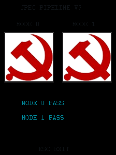

退出时对两个 descriptor 分别调用 `GUI+0x50c`，日志继续到
`MODE0 SOURCE FREED`、`MODE1 SOURCE FREED`、`FAILURES=0`、`RESULT=PASS`，并正常返回主菜单。

mode 1 的静态特殊路径会先检查 JPEG marker；官方标准 JPEG 未命中特殊 payload，随后
仍进入普通 decoder。当前结果不能把 mode 1 命名成不同的色彩或缩放模式。

产物 SHA-256：

```text
7dce5a52ecf56d85a48a3ddedad8027f72be6a3952f0334f0ee94f9ed15b21df
```

## GameCompatAnimationProbeV8

源码：`reverse/examples/game_compat_animation_probe.c`

输出：`A:\应用\数据\游戏\GAMEANIM.TXT`

V8 每帧重建一个 `208x64` VX 舞台，在 compatible context 上执行 `GUI+0x540`，再把
完整舞台复制到可见 context。第一版只反复执行 `object_draw_begin/copy/end`：循环日志
到达 240 帧，但 frame-chardev 只有约 16 帧，最终 framebuffer 仍接近首帧。该对照确认
`GUI+0x0e4/+0x0e8` 脱离系统初始 paint 后不能当作持续 present API。

修正版每帧使用真机 V23 已确认的动态 guard：

```text
GUI+0x540(compat, 0, 0, stage_vx)
GUI+0x074(1)
GUI+0x418(compat, 0, 0, 208, 64, visible, 16, 90, 0)
GUI+0x074(0)
```

0.8 秒采样窗口内，模拟器 frame-chardev 计数从 `354` 增至 `387`；两张 framebuffer
SHA-256 不同，移动图元位于不同位置，网格背景没有残影：

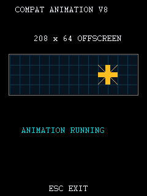

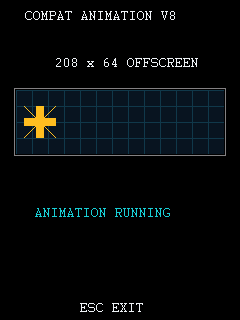

最终在第 2235 帧发送 ESC。日志确认 `COMPAT FREED`、`FAILURES=0`、`RESULT=PASS`，
窗口正常返回主菜单。这证明当前 standalone 动画的可靠提交边界是完整
`draw_guard_begin -> context_copy -> draw_guard_end`，不能省略 begin，也不能用
`object_draw_end` 替代运行期 guard。

产物 SHA-256：

```text
1716e8e2b86334a1ec36e0dde783b55a1bbda4a9f6a96dda9515a43551fcf2f9
```

## GameTickProbeV9

源码：`reverse/examples/game_tick_probe.c`

输出：`A:\应用\数据\游戏\GAMETICK.TXT`

构建目标：`build/GameTickProbeV9.bda`

静态链路已经闭环：

1. GUI table `+0x6d8` 指向 C200 `0x8012bdb0`，无参数返回全局 `0x80474094`。
2. TCU IRQ `0x8012bb90` 每次将该全局加一。
3. 初始化函数 `0x8012bcd4` 配置 25 ms 周期。
4. 官方 `BB虚拟机.bda` 保存启动 raw tick，GetTick wrapper 执行
   `(current - base) * 25`，得到毫秒值。

V9 在 8013 专用 NAND 上执行完成并正常返回菜单：

```text
START GAME TICK PROBE V9
START=0x000001FF
END=0x00000227 RAW_DELTA=40 MS=1000 POLLS=364749
ADVANCE=PASS
WRAP=PASS
FAILURES=0x00000000
RESULT=PASS
END GAME TICK PROBE V9
```

宿主通过 QEMU HMP 独立读取物理地址 `0x00474094`，两轮结果为：

```text
2062.8 ms / 83 ticks  = 24.853 ms/tick
5062.7 ms / 205 ticks = 24.696 ms/tick
```

HMP 读取暂停和自适应 instruction clock 会带来小误差，结果与 25 ms 固件配置一致。
probe 另用合成值验证 `0xfffffff0 -> 0x10` 的无符号差值为 `0x20`。公开 SDK 提供
`bda_gui_tick_count_25ms()`、`bda_gui_tick_elapsed_25ms()` 和
`bda_gui_tick_elapsed_ms()`；验证等级为模拟器稳定，真机仍待复测。

产物 SHA-256：

```text
6e2b85adccfceb5e4c2a5fa0aba8c4f63fca354953c58b398bf7ea0806b15608
```

## GamePolylineClipProbeV10

源码：`reverse/examples/game_polyline_clip_probe.c`

输出：`A:\应用\数据\游戏\GAMEG10.TXT`

构建目标：`build/GamePolylineClipProbeV10.bda`

构建和部署命令：

```powershell
python -m bda_packer reverse\examples\game_polyline_clip_probe.c `
  --title GameGfxV10 --category 9 -o build\GamePolylineClipProbeV10.bda
.\scripts\test_bda_in_emulator.ps1 .\build\GamePolylineClipProbeV10.bda -NoOpenBrowser
```

静态 ABI：

```text
GUI+0x384 -> 0x800bc340  polyline(context, point_array, count)
GUI+0x3ec -> 0x800b64f0  clip_bounds(context, out_rect)
GUI+0x3f0 -> 0x800b6520  clip_contains_point(context, point)
GUI+0x3f4 -> 0x800b65ac  clip_intersects_rect(context, rect)
```

`+0x384` 从 `point_array[0]` 读取首个 `x/y` 写入 current point，随后以 8 byte
步长遍历剩余点，每个点都调用和 `GUI+0x37c` 相同的内部 line-to 实现。因此它是
折线，不是填充多边形；闭合路径需要调用者把首点作为最后一点再次传入。

V10 在 8013 专用 NAND 上画出一条 7 点锯齿和一条闭合菱形交叉路径：

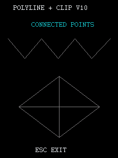

运行期 clip 查询结果：

```text
CLIP=0x00000000,0x00000000,0x000000F0,0x00000140
POINT IN=0x00000001
POINT OUT=0x00000000
RECT IN=0x00000001
RECT OUT=0x00000000
CLIP QUERY=PASS
POLYLINE CALLS=0x00000002
```

发送 ESC 后完成 `stop -> release -> event poll -> close -> return`，回到主菜单，
最终日志为：

```text
STOP=0x00000001
RELEASE=0x00000000
LOOP END
FAILURES=0x00000000
RESULT=PASS
END GAME POLYLINE CLIP PROBE V10
```

当前只把这四个入口加入逆向研究 API。`+0x3ec/+0x3f0/+0x3f4` 是只读查询，
不能据此推导 clip region 的创建、修改或释放生命周期；模拟器通过也不等于真机验证。

产物 SHA-256：

```text
2d7b707c375f8c1e95d27d113df222eb8334e921ff7d64044c881d9262622e09
```

## GameEllipseProbeV11

源码：`reverse/examples/game_ellipse_probe.c`

输出：`A:\应用\数据\游戏\GAMEG11.TXT`

构建目标：`build/GameEllipseProbeV11.bda`

构建和部署命令：

```powershell
python -m bda_packer reverse\examples\game_ellipse_probe.c `
  --title GameGfxV11 --category 9 -o build\GameEllipseProbeV11.bda
.\scripts\test_bda_in_emulator.ps1 .\build\GameEllipseProbeV11.bda -NoOpenBrowser
```

`GUI+0x390 -> 0x800b7fa0` 的核心调用形态为：

```text
ellipse(context, center_x, center_y, radius_x, radius_y, 0, 0, filled)
```

静态证据形成两条对照：

1. `电子画板.bda` 的唯一调用把最后三项全部设为 0。
2. C200 上层函数在 `0x800bb23c` 调用同一入口时，把中间两项设为 0、末项设为 1。

core 会按 `center +/- radius` 构造裁剪边界；末项为 0 时走 backend `+0xc8`，
非 0 时走 `+0xcc`。V11 分别选择 draw object 7 和 8，对每个 object 各画一次
outline 和 filled 模式：

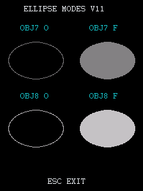

右列两项均为实心椭圆，左列均为空心轮廓，动态确认最后一项就是 fill mode。
截图中心像素显示 object 7/8 的实心颜色分别约为 RGB `(131,129,131)` 和
`(197,194,197)`；此前写入 `GUI+0x334` 的 cyan 值没有直接成为填充色，因此图元颜色
仍由 selected draw object/backend 决定。

最终日志和退出闭环：

```text
OBJECT7=0x00008410
OBJECT8=0x0000C618
FILL OLD=0x0000FFFF
ELLIPSE CALLS=0x00000004
ESC DOWN
ESC UP
STOP=0x00000001
RELEASE=0x00000000
LOOP END
FAILURES=0x00000000
RESULT=PASS
END GAME ELLIPSE PROBE V11
```

程序已回到“背单词”主菜单。研究 wrapper 只开放已验证子集
`bda_gui_ellipse_like(context,cx,cy,rx,ry,filled)`，内部把两个未完整命名的参数固定为
0；不提供允许开发者任意填写这两个参数的 raw wrapper。

产物 SHA-256：

```text
289baac5fc7c8b4546484a2256dce0c9c1adb6b756e109782e75237c15e90c96
```

## GameArcRoundRectProbeV12

源码：`reverse/examples/game_arc_round_rect_probe.c`

输出：`A:\应用\数据\游戏\GAMEG12.TXT`

构建目标：`build/GameArcRoundRectProbeV12.bda`

构建和部署命令：

```powershell
python -m bda_packer reverse\examples\game_arc_round_rect_probe.c `
  --title GameGfxV12 --category 9 -o build\GameArcRoundRectProbeV12.bda
.\scripts\test_bda_in_emulator.ps1 .\build\GameArcRoundRectProbeV12.bda -NoOpenBrowser
```

本轮恢复两个入口：

```text
GUI+0x394 -> 0x800ba660
arc(context, center_x, center_y, start_degrees, end_degrees, radius)

GUI+0x398 -> 0x800ba8dc
round_rect(context, center_x, center_y, width, height,
           corner_radius_x, corner_radius_y, filled)
```

`+0x394` 用 `center +/- radius` 构造 clip bounds，并把 start/end/radius 传给 backend
`+0xd0`。V12 的 `0→180` 得到上半圆，`180→360` 得到下半圆，确认角度单位、方向和
六参数顺序。

`+0x398` 会把 width/height 各除以 2，围绕 center 建立外框；corner x/y 半径参与
四角生成，末项控制 outline/fill。尺寸退化到角半径覆盖整块区域时，C200 会内部调用
V11 已验证的 `+0x390` 实心椭圆 core。因此它不是扇形或椭圆弧，而是中心坐标圆角矩形。

动态画面：

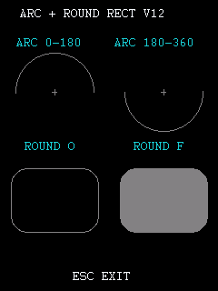

最终日志：

```text
ARC CALLS=0x00000002
ROUND RECT CALLS=0x00000002
ESC DOWN
ESC UP
STOP=0x00000001
RELEASE=0x00000000
LOOP END
FAILURES=0x00000000
RESULT=PASS
END GAME ARC ROUND RECT PROBE V12
```

程序正常返回“背单词”主菜单。当前研究 wrapper 要求非负尺寸和半径，调用者应保证
`corner_radius_x <= width/2`、`corner_radius_y <= height/2`；负数和过大圆角的退化
行为尚未作为 SDK 合同验证。

产物 SHA-256：

```text
02f88492831533d344972f063043997b8c5a3166a45e27cfecd3dc39390d5761
```

## GameMapModeProbeV13

源码：`reverse/examples/game_map_mode_probe.c`

输出：`A:\应用\数据\游戏\GAMEG13.TXT`

构建目标：`build/GameMapModeProbeV13.bda`

构建和部署命令：

```powershell
python -m bda_packer reverse\examples\game_map_mode_probe.c `
  --title GameGfxV13 --category 9 -o build\GameMapModeProbeV13.bda
.\scripts\test_bda_in_emulator.ps1 .\build\GameMapModeProbeV13.bda -NoOpenBrowser
```

`GUI+0x3a0..+0x3c4` 是连续的逻辑坐标映射状态访问器：

```text
+0x3a0  get map mode             context+0x70
+0x3a4  get viewport extent      context+0x7c/+0x80
+0x3a8  get viewport origin      context+0x74/+0x78
+0x3ac  get window extent        context+0x8c/+0x90
+0x3b0  get window origin        context+0x84/+0x88
+0x3b4  set map mode
+0x3b8  set viewport extent
+0x3bc  set viewport origin
+0x3c0  set window extent
+0x3c4  set window origin
```

map mode 非 0 时，图元使用：

```text
device_x = context_origin_x
         + (logical_x - window_origin_x) * viewport_extent_x / window_extent_x
         + viewport_origin_x
device_y = context_origin_y
         + (logical_y - window_origin_y) * viewport_extent_y / window_extent_y
         + viewport_origin_y
```

V13 先保存全部旧状态，然后设置 viewport extent `(2,2)`、viewport origin
`(30,80)`、window extent `(1,1)`、window origin `(0,0)` 并开启 map mode。逻辑
`70×30` 的交叉矩形最终显示为位于 `(30,80)` 的 `140×60` 图元，和关闭映射后画出的
外侧参考框吻合：

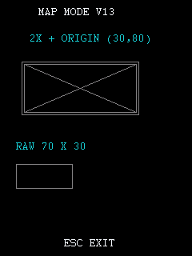

实时日志确认默认值和 setter 回读：

```text
OLD MAP MODE=0x00000000
OLD VIEW EXT=0x00000001,0x00000001
OLD VIEW ORG=0x00000000,0x00000000
OLD WIN EXT=0x00000001,0x00000001
OLD WIN ORG=0x00000000,0x00000000
SET VIEW EXT=0x00000002,0x00000002
SET VIEW ORG=0x0000001E,0x00000050
SET WIN EXT=0x00000001,0x00000001
SET WIN ORG=0x00000000,0x00000000
MAP READBACK=PASS
```

绘制后先关闭 map mode，再恢复四组 origin/extent，最后恢复旧 mode。ESC 退出最终
`FAILURES=0`、`RESULT=PASS`，主菜单显示正常。window extent 是变换除数，两个分量
都不得为 0；setter 也只接受有效非空 draw context。

产物 SHA-256：

```text
e5271e95b10d291944bfca26d65d031b7c1a9fc5c92585b9343ae9e5818f80c9
```

## GameCoordinateTransformProbeV14

源码：`reverse/examples/game_coordinate_transform_probe.c`

输出：`A:\应用\数据\游戏\GAMEG14.TXT`

构建目标：`build/GameCoordinateTransformProbeV14.bda`

构建和部署命令：

```powershell
python -m bda_packer reverse\examples\game_coordinate_transform_probe.c `
  --title GameGfxV14 --category 9 -o build\GameCoordinateTransformProbeV14.bda
.\scripts\test_bda_in_emulator.ps1 .\build\GameCoordinateTransformProbeV14.bda -NoOpenBrowser
```

静态反汇编确认四个入口都接收 `context,point*` 并原地改写 point：

```text
+0x3c8  full device-to-logical；减 context origin 后做逆映射
+0x3cc  full logical-to-device；映射后加 context origin
+0x3d0  map-only device-to-logical；不处理 context origin
+0x3d4  map-only logical-to-device；不处理 context origin
```

V14 保存原 mapping 状态后设置 viewport extent `(3,2)`、viewport origin `(20,40)`、
window extent `(2,1)`、window origin `(5,7)`。已知逻辑点 `(25,27)` 的 map-only
forward 结果应为 `(50,80)`；随后分别验证 map-only 和 full pair 的逆变换。当前 draw
context origin 为零，因此 full forward 也得到 `(50,80)`：

```text
LOGICAL=0x00000019,0x0000001B
MAP L2D=0x00000032,0x00000050
MAP D2L=0x00000019,0x0000001B
FULL L2D=0x00000032,0x00000050
FULL D2L=0x00000019,0x0000001B
FAILURES NOW=0x00000000
COORD XFORM=PASS
```

逻辑坐标下绘制的十字/圆与关闭映射后在转换结果处绘制的物理参考框重合：

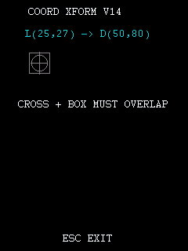

ESC 退出日志为 `STOP=1`、`RELEASE=0`、`FAILURES=0`、`RESULT=PASS`，正常返回主菜单；
8013 保持运行，`invalid=0`。BDA SHA-256：

```text
b61f72aa58cca7ce49b8fd97b45a014f40b866810877b1e94a92b17677d71c48
```

V14 阶段还只静态确认 `GUI+0x3e4` 是可空矩形的 clip selection/reset；后续 V15
已经完成动态验证，并补充了 reset 后 `+0x3ec` 返回零矩形哨兵的真实合同。

## GameClipSelectProbeV15

源码：`reverse/examples/game_clip_select_probe.c`

输出：`A:\应用\数据\游戏\GAMEG15.TXT`

构建目标：`build/GameClipSelectProbeV15.bda`

构建和部署命令：

```powershell
python -m bda_packer reverse\examples\game_clip_select_probe.c `
  --title GameGfxV15 --category 9 -o build\GameClipSelectProbeV15.bda
.\scripts\test_bda_in_emulator.ps1 .\build\GameClipSelectProbeV15.bda -NoOpenBrowser
```

V15 在有效 object-draw scope 中选择 `(45,75)-(195,225)` 裁剪矩形，随后复用 V10
确认的 `+0x3ec/+0x3f0/+0x3f4` 做边界、点命中和矩形相交检查。横线和两条对角线
只出现在矩形内部，证明裁剪不仅修改查询结构，也实际约束图元 backend：

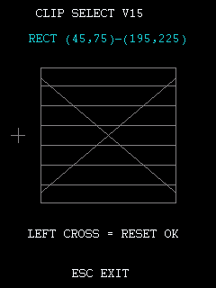

关键日志：

```text
INITIAL=0x00000000,0x00000000,0x000000F0,0x00000140
SELECTED=0x0000002D,0x0000004B,0x000000C3,0x000000E1
POINT INSIDE=0x00000001
POINT OUTSIDE=0x00000000
RECT INSIDE=0x00000001
RECT OUTSIDE=0x00000000
RECT CROSSING=0x00000001
RESTORED=0x00000000,0x00000000,0x00000000,0x00000000
RESTORED OUTSIDE POINT=0x00000001
RESTORED OUTSIDE RECT=0x00000001
CLIP SELECT=PASS
```

`+0x3e4(context,NULL)` 后，`+0x3ec` 返回零矩形作为“无自定义 region”哨兵，
但点/矩形命中和实际绘图已经回退到完整 context bounds。不能把该零矩形解释成
“所有绘图都被裁掉”。V15 在 reset 后画出的左侧十字提供了独立视觉证据。

退出日志为 `STOP=1`、`RELEASE=0`、`FAILURES=0`、`RESULT=PASS`；8013 继续运行，
`invalid=0`。最终 BDA SHA-256：

```text
db39d5aba103b0d118e774004d3c0020b750e2989754a663c1e9cee3e87342dd
```

## GameClipExcludeProbeV16

源码：`reverse/examples/game_clip_exclude_probe.c`

输出：`A:\应用\数据\游戏\GAMEG16.TXT`

构建目标：`build/GameClipExcludeProbeV16.bda`

构建和部署命令：

```powershell
python -m bda_packer reverse\examples\game_clip_exclude_probe.c `
  --title GameGfxV16 --category 9 -o build\GameClipExcludeProbeV16.bda
.\scripts\test_bda_in_emulator.ps1 .\build\GameClipExcludeProbeV16.bda -NoOpenBrowser
```

静态反汇编确认 `GUI+0x3d8` 使用 `context,left,top,right,bottom`，其内部 helper 会把
每个相交 region 节点拆成排除矩形四周最多四个剩余条带。V16 先选择外框
`(30,70)-(210,230)`，再排除 `(85,110)-(155,190)`，形成中央 `70×80` hole：

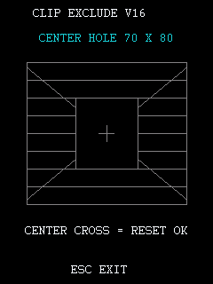

关键日志：

```text
EXCLUDED BOUNDS=0x0000001E,0x00000046,0x000000D2,0x000000E6
RING POINT=0x00000001
HOLE POINT=0x00000000
OUTSIDE POINT=0x00000000
HOLE RECT=0x00000000
CROSSING RECT=0x00000001
RESTORED=0x00000000,0x00000000,0x00000000,0x00000000
RESTORED HOLE POINT=0x00000001
CLIP EXCLUDE=PASS
```

中央 hole 不改变 region 的 aggregate bounds，所以 `+0x3ec` 仍返回完整外框；
`+0x3f0/+0x3f4` 和实际绘图才体现内部空洞。调用 `+0x3e4(context,NULL)` 后，中央
十字可以绘制且 hole 中心重新命中。

退出日志为 `STOP=1`、`RELEASE=0`、`FAILURES=0`、`RESULT=PASS`；8013 保持运行，
`invalid=0`。BDA SHA-256：

```text
d5afcf422d96cfd35fbce6539d6df2e2bb43494f775a3a8af245567305d7cebc
```

## GameClipUnionProbeV17

源码：`reverse/examples/game_clip_union_probe.c`

输出：`A:\应用\数据\游戏\GAMEG17.TXT`

构建目标：`build/GameClipUnionProbeV17.bda`

构建和部署命令：

```powershell
python -m bda_packer reverse\examples\game_clip_union_probe.c `
  --title GameGfxV17 --category 9 -o build\GameClipUnionProbeV17.bda
.\scripts\test_bda_in_emulator.ps1 .\build\GameClipUnionProbeV17.bda -NoOpenBrowser
```

V17 先选择左块 `(30,80)-(95,225)`，再通过 `GUI+0x3dc` 追加右块
`(145,80)-(210,225)`。两个 region 节点都能约束实际绘图，中间 gap 保持不可见：

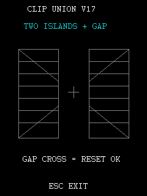

关键日志：

```text
REPORTED BOUNDS=0x0000001E,0x00000050,0x0000005F,0x000000E1
LEFT POINT=0x00000001
RIGHT POINT=0x00000001
GAP POINT=0x00000000
OUTSIDE POINT=0x00000000
GAP RECT=0x00000000
CROSSING RECT=0x00000001
RESTORED=0x00000000,0x00000000,0x00000000,0x00000000
RESTORED GAP POINT=0x00000001
CLIP UNION=PASS
```

`+0x3ec` 没有扩展到右块，仍报告原左块 cached bounds；右块的点命中、跨区域矩形
查询和实际绘图均已通过，说明并集节点本身有效。多节点 region 应依赖
`+0x3f0/+0x3f4`，不能依赖 `+0x3ec` 推导完整外接框。

退出日志为 `STOP=1`、`RELEASE=0`、`FAILURES=0`、`RESULT=PASS`；8013 保持运行，
`invalid=0`。最终 BDA SHA-256：

```text
e836e755973711a5a8826938f960a5ac4a0a604722277e9e9043b4317c47c086
```

## GameClipIntersectProbeV18

源码：`reverse/examples/game_clip_intersect_probe.c`

输出：`A:\应用\数据\游戏\GAMEG18.TXT`

构建目标：`build/GameClipIntersectProbeV18.bda`

构建和部署命令：

```powershell
python -m bda_packer reverse\examples\game_clip_intersect_probe.c `
  --title GameGfxV18 --category 9 -o build\GameClipIntersectProbeV18.bda
.\scripts\test_bda_in_emulator.ps1 .\build\GameClipIntersectProbeV18.bda -NoOpenBrowser
```

V18 先建立左右两个裁剪节点，再通过 `GUI+0x3e0` 与
`(50,110)-(190,190)` 求交。结果保留两个独立裁剪岛，中间 gap 不可见；重置裁剪
后才绘制 gap 中心十字：

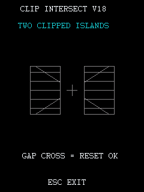

关键日志：

```text
INTERSECT BOUNDS=0x00000032,0x0000006E,0x000000BE,0x000000BE
LEFT POINT=0x00000001
RIGHT POINT=0x00000001
GAP POINT=0x00000000
CLIPPED POINT=0x00000000
GAP RECT=0x00000000
CROSSING RECT=0x00000001
RESTORED=0x00000000,0x00000000,0x00000000,0x00000000
RESTORED GAP POINT=0x00000001
CLIP INTERSECT=PASS
```

与 V17 的 union 不同，intersect 会重新计算 aggregate bounds，所以 `+0x3ec` 正确
返回 `(50,110)-(190,190)`。退出日志为 `STOP=1`、`RELEASE=0`、`FAILURES=0`、
`RESULT=PASS`；8013 保持运行，`invalid=0`。BDA SHA-256：

```text
a301f4ff0e4d9c2b1b6a50999c5c43824a9c64ddf24a1816e694d782d494305d
```

## GameDoubleBufferSpriteProbeV19

源码：`reverse/examples/game_double_buffer_sprite_probe.c`

输出：`A:\应用\数据\游戏\GAMEG19.TXT`

构建目标：`build/GameDoubleBufferSpriteProbeV19.bda`

构建和部署命令：

```powershell
python -m bda_packer reverse\examples\game_double_buffer_sprite_probe.c `
  --title GameGfxV19 --category 9 -o build\GameDoubleBufferSpriteProbeV19.bda
.\scripts\test_bda_in_emulator.ps1 .\build\GameDoubleBufferSpriteProbeV19.bda -NoOpenBrowser
```

V19 同时创建 back 和 sprite 两块 compatible context，逐帧执行：

```text
GUI+0x540(background_vx -> back)
GUI+0x540(sprite_vx -> sprite)
GUI+0x418(sprite -> back, moving destination)
GUI+0x074(1)
GUI+0x418(back -> visible)
GUI+0x074(0)
```

两张采样画面中的精灵位于不同位置且颜色不同，网格在旧位置完整恢复，没有残影：

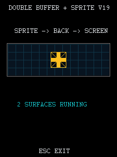

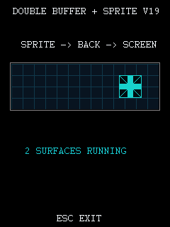

关键日志：

```text
BACK=0x80963E7C
SPRITE=0x80964398
FIRST BACKGROUND DRAW=0x00000000
FIRST SPRITE DRAW=0x00000000
FIRST SPRITE COPY=0x00000000
FIRST PRESENT COPY=0x00000000
BACK FREED
SPRITE FREED
FRAMES=0x0001C788
FAILURES=0x00000000
RESULT=PASS
```

这确认 `+0x418` 的 destination 可以是 compatible context，并建立了 standalone BDA
可用的双缓冲合成链。精灵仍是 32x32 不透明矩形，`backend_arg=0`；本轮不证明
alpha、透明色或 color key。退出后 8013 保持运行，`invalid=0`。BDA SHA-256：

```text
d70d2dcf284053bb41b832512267449524d053c7094ab6e11ee3b85acff20630
```

## GameColorKeySpriteProbeV20

源码：`reverse/examples/game_color_key_sprite_probe.c`

输出：`A:\应用\数据\游戏\GAMEG20.TXT`

构建目标：`build/GameColorKeySpriteProbeV20.bda`

构建和部署命令：

```powershell
python -m bda_packer reverse\examples\game_color_key_sprite_probe.c `
  --title GameGfxV20 --category 9 -o build\GameColorKeySpriteProbeV20.bda
.\scripts\test_bda_in_emulator.ps1 .\build\GameColorKeySpriteProbeV20.bda -NoOpenBrowser
```

静态证据先于动态测试确定候选值：雷霆战机 `0x81c10db8` 设置 `s5=0xf81f`，并在
两次 `GUI+0x418` 前写到 `stack+0x20`；决战坦克同时存在末参数 0 和 `0xf81f` 的
分支。V20 将 32x32 sprite surface 的背景填为 RGB565 洋红 `0xf81f`，仅在
sprite→back copy 时传同一 color key。

两张采样画面都只显示精灵图案，底层网格穿过原本的洋红背景区域；精灵位置和颜色
发生变化，旧位置无残影：

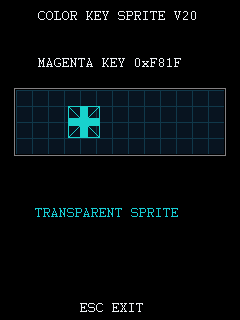

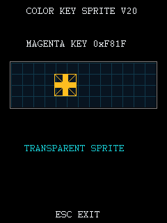

关键日志：

```text
COLOR KEY=0x0000F81F
FIRST SPRITE COPY=0x00000000
FIRST PRESENT COPY=0x00000000
BACK FREED
SPRITE FREED
FRAMES=0x00001160
FAILURES=0x00000000
RESULT=PASS
```

V19 参数 0 时深色背景不透明，V20 参数 `0xf81f` 时洋红 source pixel 被跳过，形成
正反对照。因此 `+0x418` 末参数现收窄为 RGB565 `color_key_or_zero`。alpha blending
仍未验证，V20 也仍需真机复测。退出后 8013 保持运行，`invalid=0`。BDA SHA-256：

```text
77533654e25ce059c0343c7b72ac748ccf254408ae47ab8774e83756c88cc1c7
```

## GameDirtyRectSpriteProbeV21

源码：`reverse/examples/game_dirty_rect_sprite_probe.c`

输出：`A:\应用\数据\游戏\GAMEG21.TXT`

构建目标：`build/GameDirtyRectSpriteProbeV21.bda`

构建和部署命令：

```powershell
python -m bda_packer reverse\examples\game_dirty_rect_sprite_probe.c `
  --title GameGfxV21 --category 9 -o build\GameDirtyRectSpriteProbeV21.bda
.\scripts\test_bda_in_emulator.ps1 .\build\GameDirtyRectSpriteProbeV21.bda -NoOpenBrowser
```

V21 创建 clean background、back buffer、sprite 三块 compatible context。背景只写入
clean/back 一次；首帧完整提交舞台，后续每帧执行：

```text
GUI+0x540(sprite_vx -> sprite)
GUI+0x418(clean old 32x32 -> back old 32x32, key=0)
GUI+0x418(sprite -> back current 32x32, key=0xf81f)
GUI+0x074(1)
GUI+0x418(back dirty rect -> visible dirty rect, key=0)
GUI+0x074(0)
```

dirty rect 是旧位置与新位置的最小外接矩形。第一次移动从 `x=0` 到 `x=1`，因此只
提交 `33x32`，而不是每帧提交整个 `208x64` 舞台。两张采样画面中精灵位置/颜色
不同，旧位置网格均完整恢复，没有残影或可见闪烁：

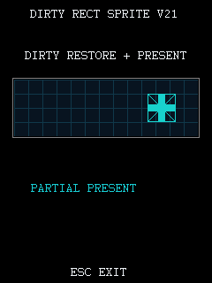

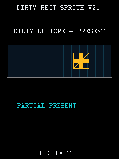

关键日志：

```text
CLEAN DRAW=0x00000000
BACK DRAW=0x00000000
FIRST FULL PRESENT=0x00000000
FIRST RESTORE=0x00000000
FIRST DIRTY COMPOSE=0x00000000
DIRTY LEFT=0x00000000
DIRTY WIDTH=0x00000021
FIRST DIRTY PRESENT=0x00000000
CLEAN FREED
BACK FREED
SPRITE FREED
FRAMES=0x0000517E
FAILURES=0x00000000
RESULT=PASS
```

这确认 `+0x418` 不要求整块 surface 尺寸，compatible source/destination 都可使用
子矩形；visible present 也可只提交局部区域。退出后 8013 正常返回菜单并保持运行，
`invalid=0`。该结论仍需真机复测，且不证明 alpha blending。BDA SHA-256：

```text
b5497b7fcb3f3a59a55cc9d1bb8be7c6097707d056c8c925b2ddbc9a5769c841
```

V19-V21 与扫雷的完整生命周期共同支持这组接口进入公开 include。稳定名称、最小代码、
双缓冲、色键和 dirty rect 图解见 `verified/game_rendering_api.md`。

## 公开 include 回归

2026-07-16 使用默认 `sdk/include/bda_sdk.h` 重新构建 `MinesweeperV1.bda`，命令中没有
研究头的 `-I sdk/api`。产物 SHA-256 为：

```text
ea450c6cb3c622eb4da274e41901c935fc1adfa85990a50803c0879fa0705298
```

8013 专用 NAND 中完成启动、触摸重绘和实体 ESC 退出，退出后固件菜单恢复；模拟器状态
保持 `invalid=0` 且无 crash snapshot。应用日志尾部为：

```text
STOP=0x00000001
RELEASE=0x00000000
LOOP END
BEFORE BACK FREE
BACK FREED
FAILURES=0x00000000
RESULT=PASS
END MINESWEEPER V1
```

替换脚本再次确认 `C200.bin` SHA-256 保持
`02a16107b11a3281067871c6fe3d4c289c910d8dfa9924573dd87f00351d6525`。

## 安全边界

- 本轮不调用 `GUI+0x3f8/+0x400`。裸 TileBlit 已在真机造成逐块 flip 后死机，不能重复猜测。
- 本轮不把 `SYS+0x09c` 当作 tick getter；C200 已确认它接收 `0..14` 的 preset index。
- 本轮只修改模拟器专用 `runtime/bda_test/bbk9588_nand.bin`，不修改 C200 固件和主 NAND。
- 大块内存一次只保留一块，验证后立即释放；最大探针为 4 MiB。

## 下一步

1. 在真机复测 V7 JPEG 双 mode、V8 guarded compatible animation、V9 25 ms tick、V10 折线/clip 查询、V11 椭圆、V12 圆弧/圆角矩形、V13 映射状态、V14 坐标转换、V15 裁剪恢复、V16-V18 region 操作以及 V19-V21 compatible surface 合成、色键和局部提交。
2. 从原机图片/游戏调用点继续恢复 alpha/其他 blend mode，并确认是否存在硬件加速 sprite 专用入口。
3. 继续恢复原机 raw `GUI+0x3f8/+0x400` full-screen blit 的 shell 状态；安全闭环前仍不直接测试。
4. 从 GAMEBOY/飞天影音退出路径恢复 raw PCM 的真正 stop/close 顺序。
5. 从雷霆根窗口过程恢复 `0x162/0x163 -> WM_TIMER` 的静态调度逻辑。
