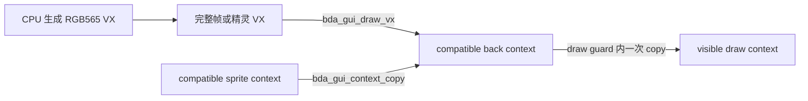
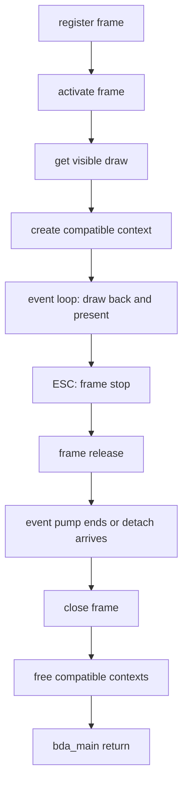
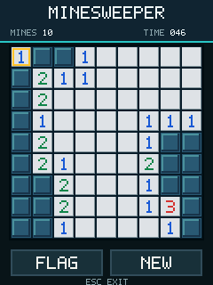

# 游戏离屏绘制、精灵与计时 API

验证环境：`bbk9588-emulator-v0.1.5`，8013 端口，完整 NAND 固件启动路径。

验证等级：模拟器稳定公开；BBK 9588 真机仍需复测。本文结论只覆盖
`kj409588/C200` 固件，不扩张到其他机型或固件版本。

完整示例：`sdk/api/examples/minesweeper_bda.c`。

## 公开 API

| 公开函数或常量 | 固件入口 | 用途 |
|---|---:|---|
| `bda_gui_compatible_context_create()` | GUI `+0x310` | 创建与可见 draw context 兼容的离屏 context |
| `bda_gui_compatible_context_free()` | GUI `+0x314` | flush 并释放 compatible context |
| `bda_gui_draw_vx()` | GUI `+0x540` | 按 VX 原始尺寸绘制 RGB565 图片 |
| `bda_gui_context_copy()` | GUI `+0x418` | 在 compatible 或 visible context 之间复制矩形 |
| `bda_gui_tick_count_25ms()` | GUI `+0x6d8` | 读取 32-bit 单调 25 ms tick |
| `bda_gui_tick_elapsed_25ms()` | 纯 SDK helper | 用无符号减法计算 tick 差值 |
| `bda_gui_tick_elapsed_ms()` | 纯 SDK helper | 把 tick 差值换算成毫秒 |
| `BDA_GUI_COLOR_KEY_NONE` | `0` | 不透明复制 |
| `BDA_GUI_COLOR_KEY_MAGENTA_RGB565` | `0xf81f` | 跳过洋红 source pixel |

这些名称是公开 SDK 的唯一名称，不提供 `_like` 兼容别名。

## 绘制模型

游戏不要把每个图元直接提交到屏幕。稳定路径是在内存或 compatible context 中完成一帧，
最后只向 visible context 提交一次。



V19 连续合成两张不同位置的精灵，背景网格没有残影：


## 创建和释放 back context

先建立并激活 frame，再从有效 visible draw context 创建 compatible context：

```c
static bda_handle_t g_visible;
static bda_handle_t g_back;

g_visible = bda_gui_current_draw(g_frame);
g_back = bda_gui_compatible_context_create(g_visible);
if (!g_back || (s32)g_back == -1) {
    /* 创建失败，不能继续绘图。 */
}
```

每个成功创建的 compatible context 必须且只能释放一次：

```c
if (g_back && (s32)g_back != -1) {
    bda_gui_compatible_context_free(g_back);
    g_back = 0;
}
```

`bda_gui_compatible_context_free()` 是破坏性释放，不是普通 present 或轻量 flush。释放后
不得继续绘图、复制或再次释放同一 handle。

## VX 图片格式

`bda_gui_draw_vx()` 接收一个完整 VX resource block。当前确认的 RGB565 形态为：

| 偏移 | 大小 | 内容 |
|---:|---:|---|
| `+0x00` | 2 | ASCII `VX` |
| `+0x02` | 4 | 固件兼容标记，现有生成器写 `0xcc` |
| `+0x06` | 4 | little-endian width |
| `+0x0a` | 4 | little-endian height |
| `+0x0e` | 10 | header 保留区 |
| `+0x18` | `width*height*2` | little-endian RGB565 pixel data |

总长度是 `24 + width * height * 2`。接口按 header 中的尺寸绘制，不缩放；传入的 buffer
必须在调用结束前保持有效。

```c
int result = bda_gui_draw_vx(g_back, 0, 0, frame_vx);
if (result != 0) {
    /* 当前验证中成功返回 0。 */
}
```

一个 `240x320` 全屏 VX 需要 `153624` byte。内存紧张时可使用较小舞台、精灵 surface
和 dirty rect，不必为每个对象保存全屏副本。

## 一次提交完整帧

只有 compatible 到 visible 的最后一次 copy 放在动态 draw guard 内：

```c
static int present_full_frame(void) {
    int result;

    if (bda_gui_draw_vx(g_back, 0, 0, frame_vx) != 0) {
        return 0;
    }

    (void)bda_gui_draw_guard_begin();
    result = bda_gui_context_copy(
        g_back, 0, 0, 240, 320,
        g_visible, 0, 0,
        BDA_GUI_COLOR_KEY_NONE
    );
    (void)bda_gui_draw_guard_end();
    return result == 0;
}
```

不能省略 `draw_guard_begin()`，也不能用 `bda_gui_object_draw_end()` 代替运行期提交。
V8 的正反实验显示，不完整的 guard 虽然循环继续运行，但 framebuffer 不会可靠更新。

## 精灵和色键

精灵可放在第二个 compatible context 中，再复制到 back context。色键参数只比较
source pixel；`0xf81f` 洋红会被跳过：

```c
(void)bda_gui_context_copy(
    sprite, 0, 0, 32, 32,
    g_back, sprite_x, sprite_y,
    BDA_GUI_COLOR_KEY_MAGENTA_RGB565
);
```

V20 中洋红背景完全透明，底层网格保持可见：


当前没有验证 alpha blending、半透明或任意颜色容差。需要透明背景时，精灵资源必须精确
写入 RGB565 `0xf81f`。

## Dirty rect

`bda_gui_context_copy()` 不要求复制整块 surface。动画可以先恢复旧位置、绘制新位置，
再只提交两者的最小外接矩形：

```c
/* 恢复旧位置。 */
(void)bda_gui_context_copy(
    clean, old_x, old_y, 32, 32,
    g_back, old_x, old_y,
    BDA_GUI_COLOR_KEY_NONE
);

/* 合成新精灵。 */
(void)bda_gui_context_copy(
    sprite, 0, 0, 32, 32,
    g_back, new_x, new_y,
    BDA_GUI_COLOR_KEY_MAGENTA_RGB565
);

/* guard 内只向屏幕提交 dirty rectangle。 */
(void)bda_gui_draw_guard_begin();
(void)bda_gui_context_copy(
    g_back, dirty_x, dirty_y, dirty_w, dirty_h,
    g_visible, dirty_x, dirty_y,
    BDA_GUI_COLOR_KEY_NONE
);
(void)bda_gui_draw_guard_end();
```

V21 首次移动只提交 `33x32`，旧位置恢复完整且无可见闪烁：


## 25 ms tick

tick counter 每 25 ms 加一。始终使用无符号差值，不能直接比较 `end >= start`：

```c
u32 start = bda_gui_tick_count_25ms();

/* 游戏循环中。 */
u32 now = bda_gui_tick_count_25ms();
u32 elapsed_ticks = bda_gui_tick_elapsed_25ms(start, now);
u32 elapsed_ms = bda_gui_tick_elapsed_ms(start, now);
u32 elapsed_seconds = elapsed_ticks / 40u;
```

V9 验证了 `0xfffffff0 -> 0x10` 的回绕差值为 `0x20`，并用宿主独立采样得到约
`24.7-24.9 ms/tick`。`elapsed_ms` 是 32-bit 乘法，超长运行程序应直接保留 tick 或
自行使用更宽的累计值。

## 窗口生命周期

离屏绘制不改变 frame 的强制退出顺序。扫雷使用并验证了以下完整链路：



不要在收到 ESC 后直接 `return`，也不要把 `close_frame` 放在 `stop/release` 之前。

## 完整示例和构建

扫雷只包含公开 `sdk/include/bda_sdk.h` 中的 API，不需要研究头：

```powershell
python -m bda_packer sdk\api\examples\minesweeper_bda.c `
  --title MinesV1 --category 4 `
  --icon-png sdk\assets\minesweeper_icon.png `
  -o build\MinesweeperV1.bda
```


2026-07-16 又从默认公开头重新构建并在 8013 回归一次，构建命令没有传
`-I sdk/api`。本次产物 SHA-256 为：

```text
ea450c6cb3c622eb4da274e41901c935fc1adfa85990a50803c0879fa0705298
```

启动后触摸未打开格子，画面立即更新；实体 ESC 随后正常返回固件菜单：



模拟器闭环覆盖首击安全、洪泛展开、插旗、失败、自动获胜、实时计时、触摸后实体 ESC、
frame 关闭和 compatible context 释放。最终日志包含：

```text
FIRST VX DRAW=0x00000000
FIRST PRESENT=0x00000000
STOP=0x00000001
RELEASE=0x00000000
BACK FREED
FAILURES=0x00000000
RESULT=PASS
```

## 已知边界

- 本文 API 已在 8013 完整固件路径重复验证并进入公开 include，但真机仍需复测。
- `bda_gui_draw_vx()` 不提供缩放、旋转或 alpha blending。
- `bda_gui_context_copy()` 当前只确认不透明复制和精确 RGB565 洋红色键。
- visible present 必须位于完整动态 draw guard 中；compatible 之间的合成不需要 guard。
- 不要用 `GUI+0x3f8/+0x400` 替代本文链路；裸 tile blit 在真机曾逐块翻转后死机。
- 每个 compatible context 都占用固件资源，创建失败必须立即降级或退出，退出时必须释放。
